# upasthiti — Technical & Product Documentation
### Navonmesh Samadhan LLP | Secure, Smart, Verified.

---

## 1. Executive Summary

**upasthiti** is a cross-platform institutional management platform that replaces paper registers, spreadsheets, and fragmented messaging tools with a single, verifiable system for attendance, leave, communication, and resource distribution. It was built by **Navonmesh Samadhan LLP** to solve a problem that affects every school, university, corporate department, and training institute that still relies on manual or easily-forged sign-in methods: proxy attendance, where one person marks presence on behalf of an absent colleague or classmate.

The institutional cost of this problem is more than an administrative nuisance. Inflated attendance records distort payroll, grading, and compliance reporting; fragmented tools (a spreadsheet for logs, email for leave, WhatsApp for announcements) destroy the audit trail an institution needs when a dispute arises; and without any geographic verification, "attendance" data cannot even confirm that a person was physically present. upasthiti addresses all three problems inside one application.

Three differentiators define the product. First, **AI-powered face verification** requires a live photo at the moment of attendance, checked against a securely registered biometric profile — not a static ID card or a shared QR code. Second, **GPS geofencing** enforces that the attendance event actually occurred within a configurable radius of the class or session location. Third, **deep hierarchical role-based access control (RBAC)** models the real reporting structure of an institution — from individual team leaders up through department heads, institution administrators, and an executive Dean role — so that leave requests, reports, and oversight automatically flow to the correct person without manual routing.

upasthiti is currently at **version 0.1.0**, reflecting an actively developed pilot/MVP-stage product. The core attendance, leave, community, and distribution workflows are fully implemented and functional across Android, iOS, and Windows. As detailed later in this document, some production-hardening work remains — most notably moving critical validation server-side and adding automated testing and monitoring — and this documentation deliberately reports those gaps alongside the platform's strengths, in keeping with a transparent, evidence-based assessment of the system as it exists today.

---

## 2. Project Vision & Product Identity

| Attribute | Detail |
|---|---|
| **Product Name** | upasthiti |
| **Tagline** | Secure, Smart, Verified. |
| **Developing Organisation** | Navonmesh Samadhan LLP |
| **Current Version** | 0.1.0 |
| **Platform Support** | Android, iOS, Windows (cross-platform via Flutter) |
| **Primary Language / Framework** | Dart / Flutter (SDK ^3.10.4) |

upasthiti is designed as a **single cross-platform codebase** — the same Flutter application runs on mobile devices carried by students and field staff and on Windows desktops used in administrative offices, without maintaining separate native applications. This is a deliberate architectural choice: institutions typically need attendance capture to work in the field (mobile) while giving office staff a familiar desktop experience for reporting and administration (Windows).

The platform targets **educational institutions** (schools, colleges, universities), **corporate departments** with distributed teams, and **training institutes** that need auditable attendance for compliance or billing purposes. Its positioning is that of a **verified attendance and institutional governance platform** rather than a simple attendance tracker: the combination of biometric verification, geofencing, and a fully modelled administrative hierarchy places it above generic QR-code or GPS-only attendance apps, while its single-application scope (attendance + leave + community + distribution) differentiates it from point solutions that address only one of these needs.

> [!NOTE]
> As a 0.1.0 release, upasthiti should be understood as a functionally complete pilot rather than a hardened enterprise deployment. Section 12 and Section 15 of this document detail the specific steps recommended before a large-scale production rollout.

---

## 3. Business Problem & Value Proposition

### 3.1 Problems Solved

Institutions relying on paper registers, manual sign-in sheets, or simple QR codes face **proxy attendance** as their most common and costly integrity failure — one individual can mark presence for several absent peers with no technical barrier preventing it. Compounding this, most institutions manage attendance, leave, resource distribution, and internal communication through **fragmented, disconnected tools** — a mix of spreadsheets, email threads, and messaging apps — which leaves no single audit trail, forces manual duplication of the same data, and removes any real accountability chain when discrepancies are questioned.

A further gap is the **lack of geographic verification**: without GPS enforcement, a recorded attendance event carries no proof that the person was physically present at the required location. Finally, most generic attendance tools provide **weak or no support for administrative hierarchy** — supervisors cannot see their own team's leave requests, department heads lack an aggregate view across their teams, and institutional leadership has no executive dashboard summarising activity across the whole organisation.

### 3.2 Solution Approach

upasthiti's core innovation is a **three-layer anti-fraud verification chain** that must be passed in sequence before any attendance record is created:

1. **Time Window Enforcement** — attendance can only be marked within a configurable ±10-minute window around a scheduled session, eliminating both pre-marking and retroactive marking.
2. **GPS Geofencing** — the device's live location is checked with the Haversine distance formula against a circular boundary configured per class; attempts outside the boundary are blocked and explicitly flagged.
3. **AI Face Verification** — a live photo captured at the moment of marking is compared against the user's registered facial embedding by a remote ML service; a mismatch blocks the record entirely.

Only when **all three checks pass** is an attendance log created, and that log permanently retains the photographic evidence and geofence result for later audit. This composite design means defeating the system requires simultaneously defeating time, location, and biometric identity checks — a materially higher bar than any single-factor system.

### 3.3 Value by Stakeholder

| Stakeholder | Business Value |
|---|---|
| **Dean (Executive Leadership)** | Institution-wide, real-time visibility with no manual report consolidation; a single executive control panel over all admins, classes, and distribution activity |
| **HR Admin** | Automated, hierarchy-aware leave approval workflow; exportable HR/compliance reports; biometric enrollment tracking without IT involvement |
| **Office Admin** | Student-by-student attendance lookup; PDF, CSV, and Excel export on demand; ability to re-register a student's biometric profile directly |
| **Security Admin** | An immutable, searchable audit log; automatic detection of geofence-violation anomalies; direct control over account access and suspension |
| **Department Heads (L2 Admins)** | Departmental analytics; approval authority over their team leaders' leave requests; cross-class attendance aggregation for their department |
| **Students / Employees** | Self-service password recovery; real-time class and enrollment updates; visibility into leave status; instant notification of distribution events |

---

## 4. Complete Feature Matrix

The following tables enumerate the confirmed feature set of upasthiti, organised by functional domain. "Technical Method" reflects the underlying implementation as reviewed from the codebase.

### 4.1 Authentication & Account Security

| Feature | Description | Role(s) | Technical Method |
|---|---|---|---|
| Animated Splash Screen | Logo fade/scale-in (1.5 s) then fade/scale-out (1 s), 800 ms crossfade to login | All | `CurvedAnimation` with `easeOutBack`, `AnimatedSwitcher` |
| Employee Login | Username + password login with dual-mode verification | Student/Employee | Query `users` by `username`; SHA-256 / plaintext dual verifier |
| Silent Password Hash Upgrade | Plaintext legacy passwords are hashed on next successful login | Student/Employee | Automatic re-write of `password` field to SHA-256 hash |
| Admin Login with CAPTCHA | Dedicated login per admin type with math CAPTCHA gate | All Admin Roles | Randomly generated arithmetic problem; credential fields disabled until solved |
| Role & Level Enforcement | Rejects login if role/level doesn't match the selected portal | All Admin Roles | DB query checks `role` and `level` fields against portal requirement |
| Dean Secret Gesture | Super Admin portal hidden behind 5 rapid taps on the app logo | Dean | Gesture detector reveals a normally-invisible "Super Admin Portal" button |
| Forgot Password (3-Step) | Identity → security question → password reset wizard | Student/Employee, Admins | Case-insensitive security answer comparison; SHA-256 re-hash on reset |
| Profile Settings | Change password; update security question/answer | Student/Employee | Re-hash on save; five predefined question options |
| Inactive Account Cleanup | Deletes accounts inactive 60+ days, including stored photo | System (background) | Triggered during admin login flow; deletes Storage file then DB document |
| `lastLogin` Tracking | Timestamp recorded on every successful login | All | Written to `users.lastLogin` on each login |

### 4.2 Student / Employee Portal

| Feature | Description | Role(s) | Technical Method |
|---|---|---|---|
| My Classes | Enrolled classes shown in real time | Student | Realtime subscription on `classes` collection |
| Invited Classes | Admin-added students see a special "Invited" indicator and auto-enroll | Student | Username matched against `invitedStudents` list in `boundary` JSON |
| Pending Requests | Join requests awaiting admin decision | Student | Status badge on class card |
| Rejected Requests | Explicitly rejected join requests, shown separately | Student | Username matched against `rejectedStudents` array |
| Explore Your Department | Browse and request to join department classes | Student | Filter classes by matching `department` field |
| New Class Acceptance Notification | Animated dialog when a join request is approved | Student | Diff detection between fetches; auto-dismiss after 4 s |

### 4.3 Attendance System

| Feature | Description | Role(s) | Technical Method |
|---|---|---|---|
| Class Detail Page | Primary attendance-marking interface | Student | Displays class metadata, history, active period status |
| Time-Bounded Attendance Periods | Admin-defined session windows with ±10-minute grace | Student, Admins | Period sub-document with `startTime`/`endTime`; client-side window check |
| GPS Geofence Check | Blocks marking outside the configured radius | Student | Haversine distance via `Geolocator.distanceBetween()` |
| AI Face Verification | Live photo compared to registered embedding | Student | Multipart POST to ML backend `/login-face` |
| Photo Upload | Verified photo stored as permanent evidence | Student | Upload to `attendance_photos` Appwrite Storage bucket |
| Attendance Log Creation | Immutable record created on full pass | System | Document in `attendance_logs` with username, classId, periodId, timestamp, photoUrl |
| Admin Verification Override | Admin can set Present/Verified/Absent | Admins | Update `adminVerifiedStatus` field |
| Soft Delete of Logs | Hide logs without physical deletion | Admins | `isHiddenFromAdmin` boolean flag |

### 4.4 Geofencing

| Feature | Description | Role(s) | Technical Method |
|---|---|---|---|
| Interactive Boundary Map | Tap-to-set-centre map with radius slider (30–500 m) | Admins | `flutter_map` (OpenStreetMap tiles) + `latlong2` |
| Boundary Storage | Geographic data stored as JSON | System | `{"lat":..., "lng":..., "radiusMeters":...}` inside class `boundary` field |
| "Use My Location" | Auto-centre map to admin's current GPS position | Admins | `geolocator` current-position fetch |
| Optional Per-Class | Classes without a boundary skip geofence checks | Admins | Conditional logic: skip if `boundary` unset |

### 4.5 AI Face Recognition

| Feature | Description | Role(s) | Technical Method |
|---|---|---|---|
| Face Registration | Selfie captured at onboarding, embedding stored remotely | Student/Employee | Multipart POST to `/register-face` on Hugging Face Spaces |
| Face Verification | Live photo compared against stored embedding at each attendance mark | Student/Employee | Multipart POST to `/login-face`; JSON `{"verified": true/false}` |
| Cold-Start Retry Logic | Handles ML service sleep/wake cycle transparently | System | 3 attempts, 3/6/9 s backoff, 60 s timeout per request |
| Windows Camera Workaround | Enables face capture on Windows desktop | Student/Employee (Windows) | Opens bundled `camera.html` in browser, then file picker |
| On-Device Pre-Validation | Avoids wasted API calls on blank/no-face frames | Student/Employee | `google_mlkit_face_detection` client-side check |

### 4.6 Community / Messaging

| Feature | Description | Role(s) | Technical Method |
|---|---|---|---|
| Channel Tab | Class-wide broadcast visible to all members | Student, Admins | Realtime subscription on `community_messages` |
| Direct Messages (Student) | Private thread with the class admin | Student | Filtered by `recipientId` |
| Direct Messages (Admin) | List of all students; tap to open any thread | Admins | Query by `classId`, grouped by `senderId`/`recipientId` |
| File Attachments | Upload and share any file type in chat | Student, Admins | `file_picker` + upload to `community_files` bucket |
| Realtime Delivery | Instant message delivery with zero-latency local echo | Student, Admins | Appwrite Realtime WebSocket stream |

### 4.7 Leave Management

| Feature | Description | Role(s) | Technical Method |
|---|---|---|---|
| Leave Submission | Category, date range, and reason (500-char max) | Student/Employee, Admins | Form → `leave_requests` document creation |
| Hierarchical Routing | Auto-routes to the correct approver by requester level | System | `AdminHierarchyService.resolveApprovers()` |
| Approve / Reject | Approver actions the request with optional reason | Admins | `LeaveService.updateStatus()` |
| HR Dedicated Leave Module | Centralised inbox for all department leave requests | HR Admin | `_HRLeaveTab` component |
| Leave History | Full history viewable by requester and approver | Student/Employee, Admins | Query `leave_requests` by `userId` |
| CSV / Excel Export | Export leave records for payroll/compliance | HR Admin | `csv` / `excel` packages |

### 4.8 Distribution System

| Feature | Description | Role(s) | Technical Method |
|---|---|---|---|
| Event Lifecycle (Draft → Active → Closed) | Full CRUD over distribution events | Dean, Event Admin | `DistributionService.createEvent()` / `updateEventStatus()` |
| Recipient Management | Add individually or bulk-import via Excel | Dean, Event Admin | `addRecipient()` / `bulkAddRecipients()` |
| Scanner Admin Assignment | Authorises specific admins to scan for an event | Dean, Event Admin | `event_admin_assignments` collection |
| QR Code Generation | Personalised QR encoding username | Student/Employee | `qr_flutter`; `DistributionService.encodeQr()` |
| QR Scanning (Kiosk) | Camera-based scan validating eligibility | Event Admin | `mobile_scanner`; `processScan()` |
| Scan Outcomes | success / alreadyIssued / notInList / eventNotActive / notAuthorized / revoked | Event Admin | `ScanStatus` enum |
| Scan Logging | Every scan attempt permanently logged | System | `distribution_scan_logs` collection |
| Student Acknowledgement | "Got it" confirms receipt | Student/Employee | `acknowledgeReceipt()`; status → `acknowledged` |

### 4.9 Admin Portals (Role-by-Role)

| Role | Unique Portal Features |
|---|---|
| **L1 Institution Admin** | Institution-wide class list; assigns L2/L3 admins; global real-time log feed with cursor pagination; CSV export |
| **L2 Head of Department** | Department-scoped classes (via `AdminHierarchyService.fetchClassesForAdmin()`); approves L3 leave |
| **L3 Team Leader** | Own-class management only; runs attendance periods; class-scoped logs and community |
| **Office Admin** | 6 tabs: Overview, Students, Reports, Biometrics (re-registration), Verify, Audit Trail; PDF/CSV/Excel export |
| **HR Admin** | 4 tabs: Dashboard, Approvals, Leave, Reports; leave data export |
| **Event Admin** | 3 tabs: Events, Kiosk (QR scanner), Tracking |
| **Security Admin** | 3 tabs: Audit Logs (searchable), Anomalies (geofence violations), Access Control |
| **Dean (Super Admin)** | 4 tabs: Admin Personnel, Distribution, Admin Reports, System Settings; gold-themed UI |

### 4.10 Reporting & Export

| Format | Available In | Content |
|---|---|---|
| PDF | Office Admin | Formatted per-student attendance summaries |
| CSV | L1 Admin, Office Admin, HR Admin | Attendance logs, leave records |
| Excel (XLSX) | Dean, Office Admin, HR Admin, Event Admin | Multi-sheet workbooks with detailed records |

### 4.11 UI / UX

| Feature | Description | Technical Method |
|---|---|---|
| Dark Theme | Dark backgrounds (`#101010`, `#10121C`) with light card surfaces | Centralised `AppTheme` token system |
| Rising Sheet Animation | Bottom sheet rises with a spring-style animation | Custom widget, `AppTheme.bottomSheet` decoration |
| Poppins Typography | Consistent Google Fonts typography throughout | `google_fonts` package |
| Per-Role Colour Accents | Each portal has a distinct accent colour | Role-mapped hex constants |
| Profile Avatars | Photo or initials fallback | `UserAvatar` component |
| Skeleton Loaders | Placeholder shimmer during data fetch | Custom loading widgets |

---

## 5. User Workflows

### 5.1 New User Onboarding

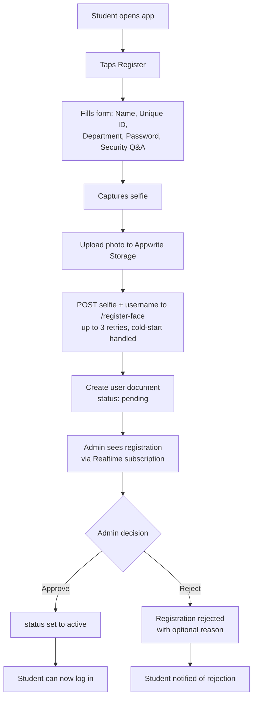

### 5.2 Student Attendance Marking (Full 3-Layer Chain)

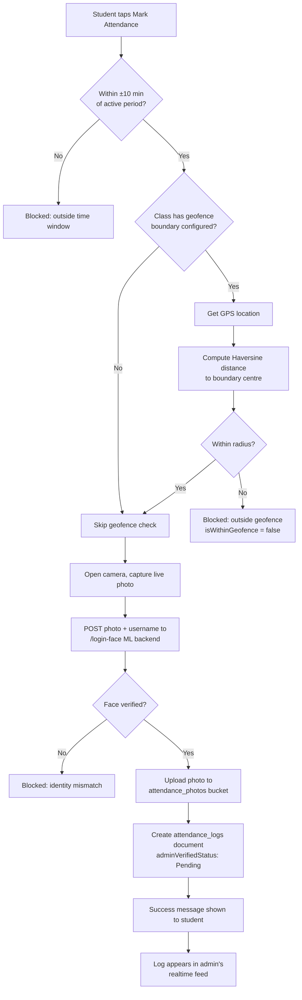

### 5.3 Leave Request → Approval Lifecycle

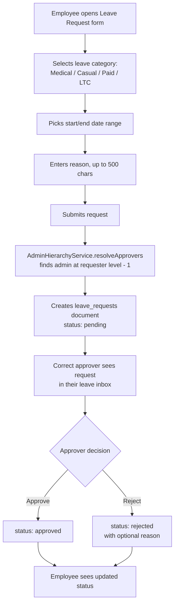

### 5.4 Distribution Event Lifecycle

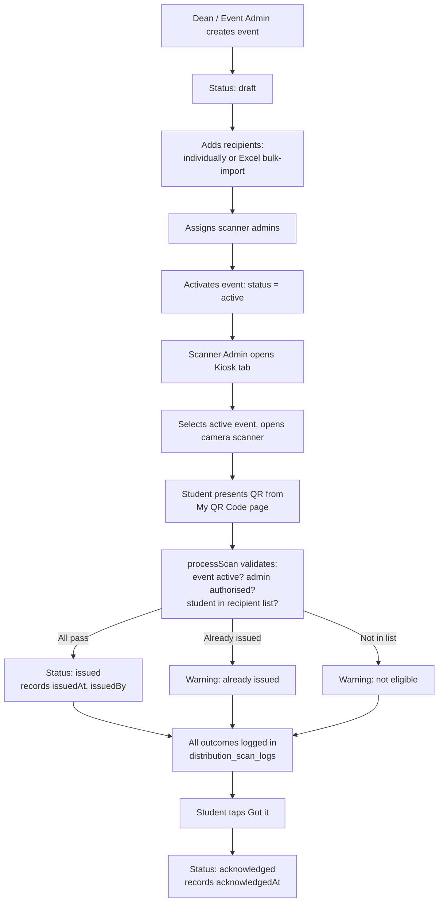

### 5.5 Admin Reviewing Attendance & Exporting Reports

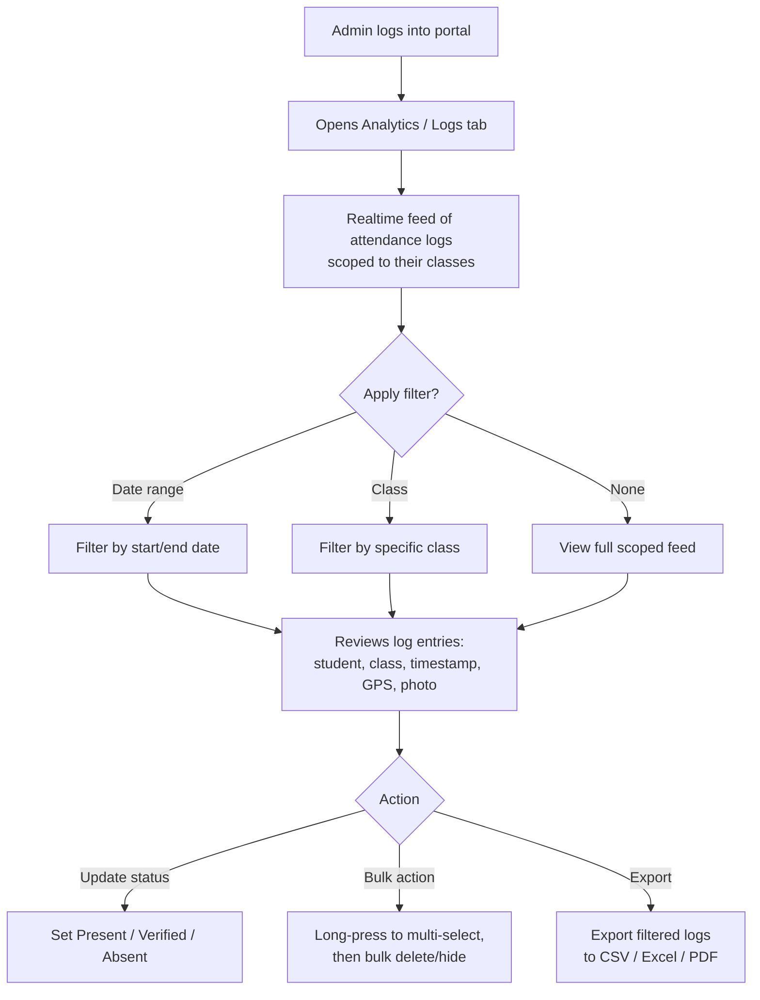

### 5.6 Forgotten Password Self-Service Recovery

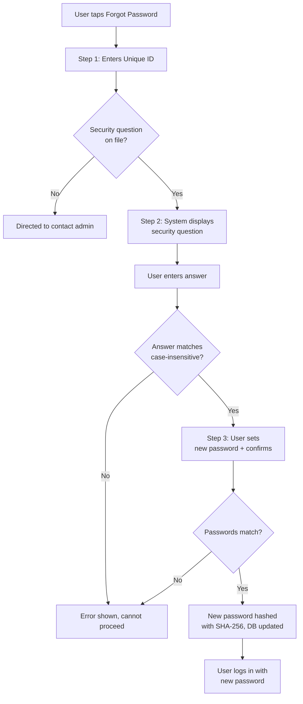

---

## 6. System Architecture

### 6.1 Architecture Overview

upasthiti follows a **decoupled Client–BaaS (Backend-as-a-Service) architecture** supplemented by an external machine-learning microservice. The Flutter application is a thick client responsible for all UI rendering, local state, and business-rule evaluation (time windows, geofence math, and orchestration of the verification chain); it holds no server-side logic of its own. All persistent data operations — reads, writes, file storage, and live updates — are delegated to **Appwrite Cloud**, and there is no custom REST API server sitting between the app and its data.

Identity verification is delegated further still, to a **separately hosted Python microservice on Hugging Face Spaces**, reached over plain HTTP multipart requests rather than through the Appwrite SDK. This keeps the compute-heavy face-embedding work isolated from both the Flutter client and the Appwrite project, at the cost of introducing a second, independently-available external dependency (see Section 11.2 for its resilience handling).

The practical effect of this design is that upasthiti requires **no server infrastructure to provision, patch, or scale** for its core data layer — Appwrite Cloud handles that entirely as a managed service — while the ML component remains the one piece of the stack that behaves like a traditional hosted service, complete with its own uptime characteristics discussed in Section 12.

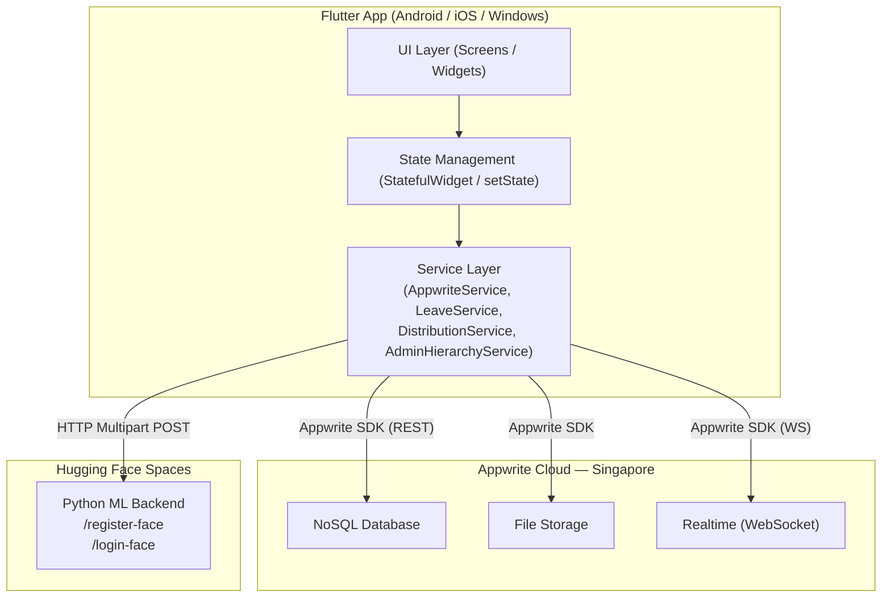

### 6.2 Component Interaction

Every screen in the application is built as a `StatefulWidget`; there is no external state management library such as Provider, Riverpod, or BLoC. Each screen owns its own data lifecycle: it fetches data from Appwrite on `initState()`, subscribes to any relevant Realtime channel, and updates its local state directly via `setState()`. Below the UI, four **service singletons** — `AppwriteService`, `LeaveService`, `DistributionService`, and `AdminHierarchyService` — abstract every backend interaction so that screens never call the Appwrite SDK directly.

`AppwriteService` initialises one shared `Client`, `Databases`, `Storage`, and `Realtime` instance for the entire app lifetime, targeting the Singapore-region endpoint. When a screen needs data, it calls into the relevant service, which issues an Appwrite SDK call (a REST call under the hood); when a screen needs a live feed, it calls `Realtime.subscribe()` and listens on the returned Dart `Stream`. Face verification follows a separate path entirely: the relevant page constructs an HTTP multipart request directly and posts it to the Hugging Face endpoint, independent of the Appwrite SDK.

### 6.3 Realtime Data Layer

Appwrite Realtime provides a **WebSocket-based push channel** that notifies subscribed clients the instant a document in a watched collection is created, updated, or deleted. upasthiti uses this on five screens — the student home page (`classes`), the admin logs tab (`attendance_logs`), the registration approval queue (`users`), the community chat (`community_messages`), and the distribution tab (`distribution_events`). Each subscription is opened in `initState()` and explicitly closed in `dispose()` to avoid leaking WebSocket connections.

From a user-experience perspective, this is what makes upasthiti feel instantaneous: a student sees a newly-accepted class appear on their home screen without pulling to refresh, an admin sees a new attendance mark land in their log feed the moment it is created, and a chat message appears for all participants without any manual reload. The trade-off, discussed further in Section 14.2, is that every subscription is collection-wide rather than query-scoped — any change anywhere in the collection triggers a full re-fetch on the listening screen.

### 6.4 Data Flow: Attendance Marking

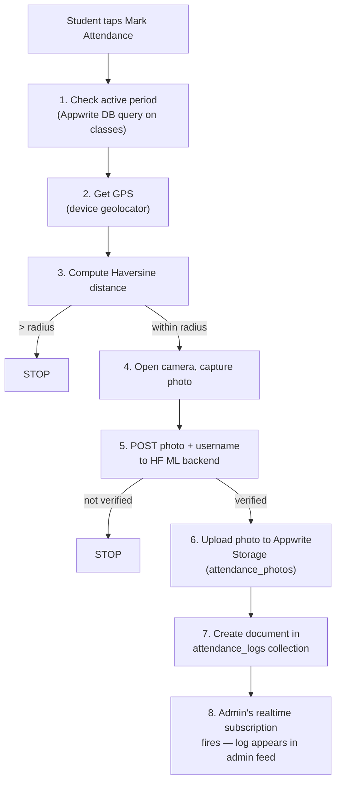

---

## 7. Role-Based Access Control (RBAC)

### 7.1 Role Hierarchy Diagram

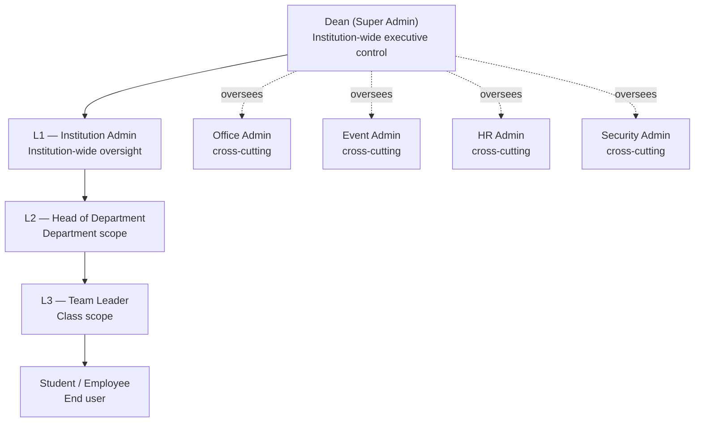

> [!NOTE]
> Office Admin, Event Admin, HR Admin, and Security Admin are **cross-cutting roles** that operate institution-wide rather than at a fixed level of the L1/L2/L3 hierarchy — they are rendered as a separate "Cross-Cutting Roles" group on the platform's own organisational chart.

### 7.2 Role Descriptions

**Student / Employee** — The primary end-user. They log in with a Unique ID and password, view and join classes, mark attendance through the full three-layer verification chain, submit leave requests, participate in class community channels, and collect distributed resources via their personal QR code. They access the standard Employee Portal (`HomePage`) and have no visibility into other users' data.

**L3 — Team Leader** — The entry-level administrator, scoped to the classes they personally create. They run attendance periods, review their own class's logs, and manage community messaging for their classes, but their analytics and reporting never extend beyond their own class list. They access the shared `AdminHomePage` with `adminLevel: 3`.

**L2 — Head of Department** — Operates at department scope, seeing classes assigned to their supervision through `AdminHierarchyService.fetchClassesForAdmin()`, which checks both direct creation and supervisor assignment metadata embedded in the class `boundary` field. They approve leave requests from their L3 team leaders and see department-scoped analytics. They access the same `AdminHomePage` shell with `adminLevel: 2`.

**L1 — Institution Admin** — The highest tier of the standard hierarchy, with institution-wide visibility over all classes regardless of creator. L1 admins create classes, assign L2 and L3 supervisors, review a global real-time log feed with cursor-based pagination, and manage the institution's student registration approval queue and organisational chart. They access `AdminHomePage` with `adminLevel: 1`.

**Office Admin** — A cross-cutting operational role focused on day-to-day student records rather than the L1–L3 hierarchy. Through a dedicated six-tab portal (`OfficeAdminHomePage`), they view departmental dashboard statistics, search the student directory, generate PDF/CSV/Excel reports, manage biometric re-registration for individual students, and perform ad-hoc identity verification checks.

**Event Admin** — A cross-cutting role dedicated to institutional and distribution events, operating a three-tab portal (`EventAdminHomePage`): creating and managing events, running the QR-scanning kiosk on distribution day, and tracking per-event issuance and acknowledgement progress.

**HR Admin** — A cross-cutting role handling human-resource functions through a four-tab portal (`HrAdminHomePage`): a metrics dashboard, a registration-approval queue, a centralised leave-request inbox spanning their department, and exportable HR/compliance reports.

**Security Admin** — A cross-cutting monitoring and access-control role with a three-tab portal (`SecurityAdminHomePage`): a searchable, institution-wide audit log; an anomalies view that surfaces geofence-violation attendance records; and an access-control panel to suspend or reactivate user accounts and review login history.

**Dean (Super Admin)** — The highest authority in the system, with institution-wide executive control accessed only through a hidden five-tap gesture on the login screen's logo. The Dean's four-tab portal (`DeanHomePage`, visually distinguished with a navy-and-gold theme) manages all admin personnel across every level and role, oversees the full distribution system, reviews institution-wide attendance analytics, and configures global system settings including geofence defaults.

### 7.3 Portal Access Matrix

| Role | Portal Name | Tabs Available | Scope of Data Access |
|---|---|---|---|
| Student / Employee | Employee Portal (`HomePage`) | Home, Class Detail, Community, Profile, QR Code | Own enrolled classes; own attendance and leave records |
| L3 Team Leader | Admin Portal (`AdminHomePage`, level 3) | Classes, Analytics, Distribution, Settings | Classes they created only |
| L2 Head of Department | Admin Portal (`AdminHomePage`, level 2) | Classes, Analytics, Distribution, Settings | Classes assigned to their department/supervision |
| L1 Institution Admin | Admin Portal (`AdminHomePage`, level 1) | Classes, Analytics, Distribution, Settings | All classes institution-wide |
| Office Admin | `OfficeAdminHomePage` | Overview, Students, Reports, Biometrics, Verify, Audit Trail | All students in their department |
| Event Admin | `EventAdminHomePage` | Events, Kiosk, Tracking | All distribution events they are assigned or created |
| HR Admin | `HrAdminHomePage` | Dashboard, Approvals, Leave, Reports | Leave and registration data for their department |
| Security Admin | `SecurityAdminHomePage` | Audit Logs, Anomalies, Access Control | All attendance logs and user accounts institution-wide |
| Dean (Super Admin) | `DeanHomePage` | Admin Personnel, Distribution, Admin Reports, System Settings | All data, all roles, institution-wide |

---

## 8. Technology Stack

### 8.1 Full Stack Table

| Category | Technology | Version | Role |
|---|---|---|---|
| UI Framework | Flutter | SDK ^3.10.4 | Cross-platform UI and application logic |
| Language | Dart | ^3.10.4 (implied) | Primary programming language |
| BaaS | Appwrite Cloud | SDK ^23.1.0 | Database, Storage, Realtime |
| ML Inference | Hugging Face Spaces (Python) | N/A | Remote face recognition API |
| Map Tiles | OpenStreetMap | N/A | Free tile source for geofence map |
| Font | Google Fonts (Poppins) | ^6.2.1 | Application-wide typography |
| On-device ML | Google ML Kit Face Detection | ^0.11.0 | Client-side face pre-validation |
| Cryptography | `crypto` | ^3.0.6 | SHA-256 password hashing |
| Map Rendering | `flutter_map` | ^8.2.2 | Interactive map widget |
| Coordinate Math | `latlong2` | ^0.9.1 | LatLng type for map calculations |
| GPS | `geolocator` | ^10.1.0 | Device location access |
| Camera | `camera` | ^0.11.3 | Low-level camera stream |
| Image Picker | `image_picker` | ^1.0.7 | Photo capture (mobile) |
| File Picker | `file_picker` | ^10.3.8 | Attachment + Excel import |
| HTTP | `http` | ^1.6.0 | Multipart HTTP calls to ML backend |
| QR Generation | `qr_flutter` | ^4.1.0 | Student QR code display |
| QR Scanning | `mobile_scanner` | ^5.2.3 | Distribution kiosk scanning |
| Excel | `excel` | ^4.0.6 | XLSX generation + import parsing |
| CSV | `csv` | ^6.0.0 | CSV export |
| PDF | `pdf` | ^3.12.0 | PDF report generation |
| Print/Share | `printing` | ^5.14.3 | PDF sharing and printing |
| Date/Time | `intl` | ^0.19.0 | Date formatting |
| Path | `path_provider` | ^2.1.5 | Device storage paths for export |
| Permissions | `permission_handler` | ^12.0.1 | Runtime permission requests |
| URL Launch | `url_launcher` | ^6.3.2 | Open URLs; Windows camera workaround |
| WebView (Cross) | `webview_flutter` | ^4.13.1 | In-app web content |
| WebView (Win) | `webview_windows` | ^0.4.0 | Windows-specific WebView |
| Multi-Window (Win) | `desktop_multi_window` | ^0.3.0 | Windows multi-window support |

### 8.2 Technology Decision Rationale

**Why Flutter?** A single Dart codebase targets Android, iOS, and Windows simultaneously, which matters directly for upasthiti's usage pattern: students and field staff need mobile capture, while administrative offices need a familiar desktop experience — one codebase delivers both without duplicating development effort or risking feature drift between platforms.

**Why Appwrite?** Appwrite supplies database, file storage, and real-time infrastructure as a managed service, removing the need to build or operate a custom backend server. Its Dart SDK integrates natively with Flutter, and its NoSQL document model accommodates the schema variation between very different user types (students vs. seven distinct admin roles) more naturally than a rigid relational schema would.

**Why Hugging Face Spaces for ML?** Free hosting for a Python ML application makes Hugging Face Spaces a practical choice for an MVP or pilot deployment, at the acknowledged cost of cold-start latency and no uptime guarantee — a trade-off the application actively mitigates with retry logic, but one that Section 12.5 and Section 15.1 both flag as needing a production-grade replacement before scaled rollout.

**Why Custom Auth instead of Appwrite Auth?** Rather than using Appwrite's built-in `Account` service (which provides JWT-based sessions), upasthiti implements its own username/password check directly against the `users` collection. This was very likely chosen for full control over the custom user document schema (role, level, department, security question, etc.), at the cost of losing Appwrite's built-in session management, token refresh, and multi-factor authentication support — a trade-off examined further in Section 10.1 and Section 12.5.

### 8.3 Platform Compatibility Matrix

| Feature | Android | iOS | Windows |
|---|---|---|---|
| Login | ✅ | ✅ | ✅ |
| Registration | ✅ | ✅ | ✅ (browser camera workaround) |
| Attendance Camera Capture | ✅ | ✅ | ✅ (browser camera workaround) |
| GPS Geofencing | ✅ | ✅ | ⚠️ Depends on Windows GPS availability |
| QR Scanning | ✅ | ✅ | ✅ |
| Excel Export | ✅ | ✅ | ✅ |
| PDF Export | ✅ | ✅ | ✅ |
| Map (Geofence Picker) | ✅ | ✅ | ✅ |
| File Attachment (Chat) | ✅ | ✅ | ✅ |

---

## 9. Database Design

### 9.1 Database Overview

upasthiti's persistence layer is a single **Appwrite NoSQL database** (ID `6a2c10dc000d5e50f314`) holding all collections for the application. Appwrite's document model has no foreign-key constraints or join operations; documents reference one another purely by storing another document's ID as a string field, and any "relationship" (e.g., an attendance log pointing to its class) is resolved in application code through sequential queries rather than at the database layer.

### 9.2 Collection Schemas

**`users`**

| Field | Type | Description | Notes |
|---|---|---|---|
| `username` | String | Unique login identifier | Primary lookup key for login |
| `name` | String | Display name | |
| `password` | String | SHA-256 hash or legacy plaintext | Dual-mode verified; auto-upgraded on login |
| `role` | String | `student`, `admin`, `officeAdmin`, `eventAdmin`, `hrAdmin`, `securityAdmin`, `dean` | Enforced at every login and query |
| `level` | Integer | 1/2/3 for `admin` role | Null for non-hierarchical roles |
| `department` | String | Department/school affiliation | Used for departmental filtering |
| `status` | String | `pending` or `active` | Login blocked while `pending` |
| `profilePictureId` | String? | Appwrite Storage file ID | Optional |
| `latitude` / `longitude` | Double? | Registered location captured at registration | Optional |
| `securityQuestion` / `securityAnswer` | String? | Password-recovery Q&A | Answer stored in plaintext (see Section 10.6) |
| `lastLogin` | String? | ISO-8601 timestamp | Drives inactive-account cleanup |

**`classes`**

| Field | Type | Description | Notes |
|---|---|---|---|
| `className` | String | Human-readable class name | |
| `classCode` | String | Unique join code | |
| `createdBy` | String | Username of creating admin | |
| `studentIds` | Array\<String\> | Enrolled student usernames | See Section 9.5 for scaling limitation |
| `boundary` | String (JSON) | Geofence + admin assignment metadata | Dual-purpose field, see Section 9.5 |
| `headAdminId` / `headAdminName` | String? | Mirrored L3 head assignment | |
| `supervisorId` / `supervisorName` | String? | Mirrored L2 supervisor assignment | |
| `joinRequests` | Array\<String\>? | Pending student join requests | |
| `rejectedStudents` | Array\<String\>? | Rejected join requests | |
| `actingAs` | String? | `"dean"` when Dean-created | Audit marker |

**`attendance_logs`**

| Field | Type | Description | Notes |
|---|---|---|---|
| `userId` / `userName` | String | Student identity | |
| `classId` / `className` | String | Class reference (denormalised name) | |
| `periodId` | String? | Active period identifier | |
| `timestamp` | String | ISO-8601 mark time | |
| `photoUrl` | String? | Direct verification photo URL | |
| `adminVerifiedStatus` | String | `Pending`, `Present`, `Verified`, `Absent` | |
| `isWithinGeofence` | Boolean | GPS check result | Surfaced in Security Admin anomaly view |
| `isHiddenFromAdmin` | Boolean? | Soft-delete flag | |

**`leave_requests`**

| Field | Type | Description | Notes |
|---|---|---|---|
| `userId` / `userName` | String | Requester identity | |
| `leaveType` | String | `Medical`, `Casual`, `Paid leave`, `LTC - tour leave` | |
| `startDate` / `endDate` | String | ISO-8601 date range | |
| `reason` | String | Up to 500 characters | |
| `status` | String | `pending`, `approved`, `rejected` | |
| `approverLevel` | Integer | Requester level − 1 | |
| `approverId` | String? | Targeted approver username | Backward-compatible if absent |
| `createdAt` | String | Creation timestamp | |
| `actionBy` / `actionById` | String? | Approver who actioned the request | |

**`community_messages`**

| Field | Type | Description | Notes |
|---|---|---|---|
| `classId` | String | Owning class | |
| `senderId` / `senderName` | String | Message sender | |
| `isAdmin` | Boolean | Visual styling flag | |
| `message` | String | Text content | |
| `attachmentId` / `attachmentName` | String? | File attachment reference | |
| `timestamp` | String | ISO-8601 timestamp | |
| `recipientId` | String? | Present only for DMs | |

**`distribution_events`**

| Field | Type | Description | Notes |
|---|---|---|---|
| `title` / `description` | String | Event details | |
| `scheduledDate` | String | ISO-8601 planned date | |
| `location` | String | Physical location | |
| `status` | String | `draft`, `active`, `closed` | |
| `createdBy` | String | Creating admin | |
| `issuedCount` / `totalRecipients` | Integer | Running counters | |
| `createdAt` | String | Creation timestamp | |

**`event_recipients`**

| Field | Type | Description | Notes |
|---|---|---|---|
| `eventId` | String | Parent event | |
| `userId` / `userName` | String | Recipient identity | |
| `status` | String | `pending`, `issued`, `acknowledged`, `revoked` | |
| `issuedAt` / `issuedBy` | String? | Scan-out details | |
| `acknowledgedAt` | String? | Confirmation timestamp | |
| `packageNote` | String? | Optional note | |

**`event_admin_assignments`**

| Field | Type | Description | Notes |
|---|---|---|---|
| `eventId` | String | Parent event | |
| `adminId` / `adminName` | String | Assigned scanner admin | |
| `assignedBy` | String | Assigning admin | |
| `assignedAt` | String | ISO-8601 timestamp | |
| `isActive` | Boolean | Whether assignment is current | |

**`distribution_scan_logs`**

| Field | Type | Description | Notes |
|---|---|---|---|
| `eventId` | String | Parent event | |
| `scannedUserId` | String | Student found in QR | |
| `scannedBy` | String | Scanning admin | |
| `action` | String | `issued`, `duplicate_attempt`, `ineligible`, `revoked`, `manual_override` | |
| `timestamp` | String | ISO-8601 timestamp | |

### 9.3 Entity Relationships

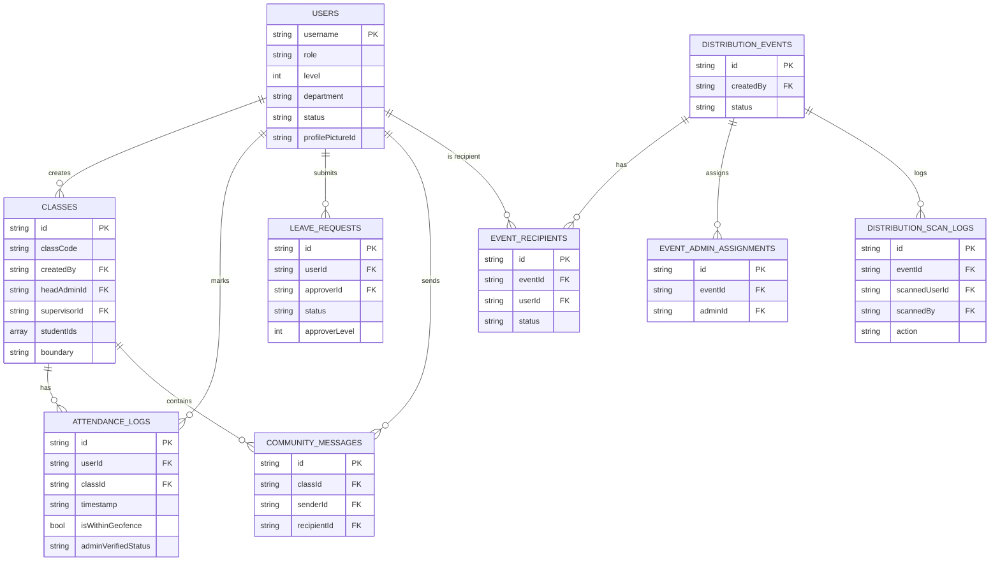

### 9.4 Storage Buckets

| Bucket | ID | Contents | Access Model |
|---|---|---|---|
| Profile Photos | `6a2c12a500260c940843` | User registration selfies | Read by authenticated app users |
| Attendance Photos | `attendance_photos` | Live verification photo per attendance mark | Write-once during marking; readable for audit |
| Community Files | `community_files` | Chat file attachments | Read/write by class members |

### 9.5 Design Decisions & Limitations

The class `boundary` field is deliberately **dual-purpose**: a single JSON string carries both the geographic geofence data (`lat`, `lng`, `radiusMeters`) and the admin assignment metadata (`headAdminId`, `headAdminName`, `supervisorId`, `supervisorName`). Two dedicated service methods — `AdminHierarchyService.geoFromBoundary()` and `readAssignments()` — parse the same field for these two unrelated concerns. This economises on schema fields at the cost of conflating two distinct data domains in one string, which is flagged in Section 15.5 as a technical-debt item worth unifying into separate top-level fields.

> [!WARNING]
> The `studentIds` array on each class document has a practical scaling ceiling. As enrollment grows into the hundreds, Appwrite's document size limits and query performance both degrade. Section 14.2 recommends replacing this pattern with a dedicated `class_enrollments` junction collection — one document per student-class pair — before deploying to very large classes.

---

## 10. Authentication & Security

### 10.1 Authentication Flow

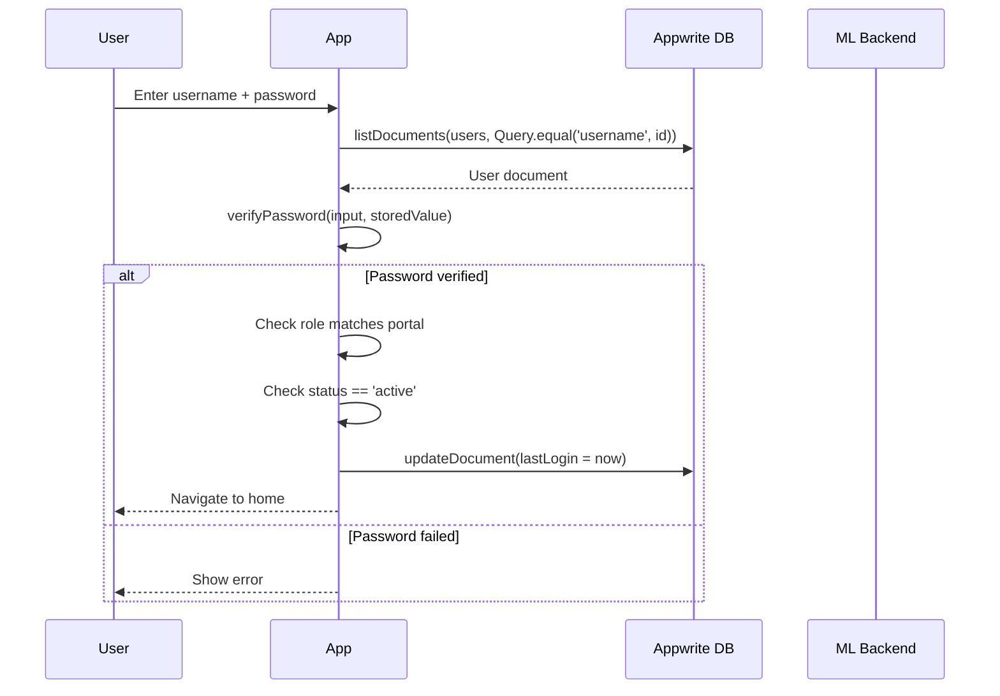

upasthiti deliberately implements a **custom credential-based authentication system** on top of the Appwrite Databases SDK, rather than using Appwrite's built-in `Account` service. Credentials live in the same `users` collection as every other user attribute (role, level, department), and verification happens entirely client-side against that document. The trade-off — no server-issued session tokens, no built-in expiry, no multi-factor support — is documented honestly in Section 10.6 and Section 12.5 as an area for future hardening, but it gives the application full control over a user schema that varies significantly between a student record and a Dean record.

### 10.2 Password Security

All new passwords are hashed with **SHA-256** (via the Dart `crypto` package) before storage, producing a 64-character hex digest; no plaintext password is ever written to or transmitted from the backend under normal operation. A **dual-mode verifier**, `AppwriteService.verifyPassword()`, checks whether the stored value matches the SHA-256 hex pattern (`^[a-f0-9]{64}$`); if it does, the input is hashed and compared, and if not, the stored value is treated as a legacy plaintext password and compared directly. On any successful login using a legacy plaintext password, the system **silently rewrites** the stored value to its SHA-256 hash — a zero-downtime, no-action-required migration path for older accounts. Minimum password length is enforced at 6 characters.

### 10.3 Admin Security Controls

Every admin portal login requires solving a **freshly generated arithmetic CAPTCHA** (e.g., `7 + 4 = ?`) before the credential fields are even enabled, providing a lightweight but real deterrent against scripted or automated login attempts targeting higher-value admin accounts. The **Dean portal is hidden entirely** — there is no visible menu item or button; it is revealed only by tapping the app logo five times in rapid succession, functioning as a form of security-through-obscurity layered on top of standard credential checks. Separately, the **account status gate** blocks any user whose `status` field is `pending` from logging in at all, and **portal-level role enforcement** re-checks the `role` (and, where applicable, `level`) field against the specific portal being accessed — a Level 2 admin's valid credentials will still be rejected on the Level 1 portal.

### 10.4 Behavioral Anti-Fraud Mechanisms

The three-layer verification chain introduced in Section 3.2 is upasthiti's principal security mechanism and deserves technical elaboration here. **Time window enforcement** restricts marking to a ±10-minute band around each period's configured `startTime`/`endTime`, closing off both premature and retroactive marking. **GPS geofencing** compares the device's live coordinates against a circular boundary using the **Haversine formula** (via `Geolocator.distanceBetween()`), which computes great-circle distance between two latitude/longitude points — any attempt outside the configured radius is blocked and, critically, still recorded with `isWithinGeofence: false` rather than silently discarded. **AI face verification** requires a live photo be sent to the remote ML backend on every attempt; the backend computes a fresh embedding from the submitted image and compares it against the registered embedding for that username, and any mismatch blocks the record outright. All three checks must pass — a partial pass is treated identically to a full failure.

### 10.5 Audit Trail

Every attendance mark produces a **permanent record** in `attendance_logs` carrying the student's username, the exact ISO-8601 timestamp, the `isWithinGeofence` boolean, and a direct URL to the live verification photo captured at the moment of marking — durable photographic evidence available for later dispute resolution. These logs are only soft-deletable via the `isHiddenFromAdmin` flag in normal operation; hard deletion is restricted to L1 admins and the Dean. In parallel, every QR scan attempt in the distribution system — successful or not — is written to `distribution_scan_logs` with the scanner's identity, the scanned student's identity, an action type, and a timestamp, giving a complete chain-of-custody record for physically distributed items.

### 10.6 Known Security Limitations

> [!IMPORTANT]
> The following limitations are inferred directly from code analysis and are stated here without embellishment, in line with this platform's transparent, evidence-based documentation standard. Each is paired with a concrete recommended improvement.

| Limitation | Risk | Recommended Improvement |
|---|---|---|
| Client-side business logic | A modified app could bypass geofence/time/face checks | Move critical checks to Appwrite Functions (server-side) |
| No server-side auth tokens | Session state held only in widget memory; no token expiry | Implement Appwrite Auth + JWT sessions |
| Security answers in plaintext | Database exposure reveals recovery answers | Hash security answers with PBKDF2 |
| No rate limiting on login | Brute-force attempts possible (CAPTCHA is client-side only) | Add server-side rate limiting via Appwrite Functions |
| QR codes encode raw username | QR codes can be screenshotted and shared for proxy distribution | HMAC-sign QR payloads with a short expiry |
| No error telemetry | Security incidents may go undetected | Integrate Sentry or similar crash/error reporting |
| No encrypted transport verification | App trusts HTTPS but performs no certificate pinning | Implement certificate pinning for production |
| Hardcoded project IDs | A leaked APK exposes the Appwrite project ID | Use obfuscation + build-time environment injection |

---

## 11. API & Integrations

### 11.1 Appwrite SDK Usage Patterns

| Operation Type | Method | Example Usage |
|---|---|---|
| Fetch by field value | `listDocuments` + `Query.equal(field, value)` | Login: `Query.equal('username', id)` |
| Fetch all in collection | `listDocuments` + `Query.limit(n)` | Admin logs: limit 500 |
| Ordered fetch | `listDocuments` + `Query.orderDesc('field')` | Logs: `Query.orderDesc('timestamp')` |
| Multi-filter | Multiple `Query.*` combined | Leave: level + status + approverId |
| Cursor pagination | `Query.cursorAfter(lastDocId)` | Infinite scroll in admin logs |
| Range filter | `Query.greaterThanEqual`, `Query.lessThan` | Date range filtering on logs |
| Array membership | `Query.equal('field', [list])` | Batch fetch by role list |
| Create document | `createDocument` + `ID.unique()` | New class, leave request, attendance log |
| Update document | `updateDocument` | Approve leave, update status, soft-delete |
| Delete document | `deleteDocument` | Hard delete of inactive user accounts |
| Upload file | `storage.createFile(bucketId, ID.unique(), file)` | Profile photo, attendance photo, community file |
| Delete file | `storage.deleteFile(bucketId, fileId)` | Delete profile photo on account cleanup |
| Get file URL | `storage.getFileView(bucketId, fileId)` | Direct display URL for photos |

### 11.2 ML Backend API Reference

**Host**: `https://pasteshub404-navikarana-backend.hf.space`

**`POST /register-face`**

| Aspect | Detail |
|---|---|
| Request | `multipart/form-data` — `username` (string), `image` (JPEG/PNG file) |
| Success Response | HTTP 200, `{"status": "registered"}` |
| Called By | `register_page.dart`, once during onboarding |

**`POST /login-face`**

| Aspect | Detail |
|---|---|
| Request | `multipart/form-data` — `username` (string), `image` (live photo file) |
| Success Response | HTTP 200, `{"verified": true}` |
| Failure Response | HTTP 200, `{"error": "Face not recognized"}` (or similar) |
| Called By | `class_detail_page.dart`, on every attendance mark attempt |

**Cold-Start Retry Mechanism**: Hugging Face Spaces may take 30–60 seconds to wake from an idle sleep state. Both endpoints are called through a **3-attempt retry loop** with exponential backoff of 3, 6, and 9 seconds between attempts, and each individual request carries a **60-second timeout** to accommodate the warm-up window. On retry attempts 2 and 3, the user sees a snackbar reading "AI model warming up… Retry 2/3"; if all three attempts fail, a clear error is surfaced and the attendance attempt is aborted.

### 11.3 Realtime WebSocket API

Channels follow the format `databases.{databaseId}.collections.{collectionId}.documents`, established via `AppwriteService.realtime.subscribe([channel])`.

| Screen | Channel (Collection) | Trigger |
|---|---|---|
| `HomePage` | `classes` | Student home refreshes on any class create/update/delete |
| `AdminHomePage` (Logs tab) | `attendance_logs` | New attendance entries appear immediately |
| `AdminApprovalRequestsPage` | `users` | New pending registrations appear instantly |
| `CommunityPage` | `community_messages` | New messages delivered live in channel or DM thread |
| `AdminDistributionTab` | `distribution_events` | Event status changes propagate immediately |

Each subscription triggers a coarse-grained `_fetchData()` call on any received event rather than merging the specific change — a simplification that avoids complex merge logic at the cost of a full re-fetch on every change (see Section 14.2).

### 11.4 Third-Party Integrations Overview

| Integration | Type | Purpose |
|---|---|---|
| Appwrite Cloud | Backend-as-a-Service | Database, Storage, Realtime — sole backend for the app |
| Hugging Face Spaces | ML inference microservice | Face embedding registration and verification |
| OpenStreetMap | Map tile service | Free tile source (zoom level 16) for the geofence boundary picker; no API key required |
| Google Fonts | Typography CDN | Poppins font, loaded at runtime and cached after first launch |
| Google ML Kit | On-device ML | Client-side face pre-validation before submitting to the remote ML backend |

### 11.5 Integration Dependency Diagram

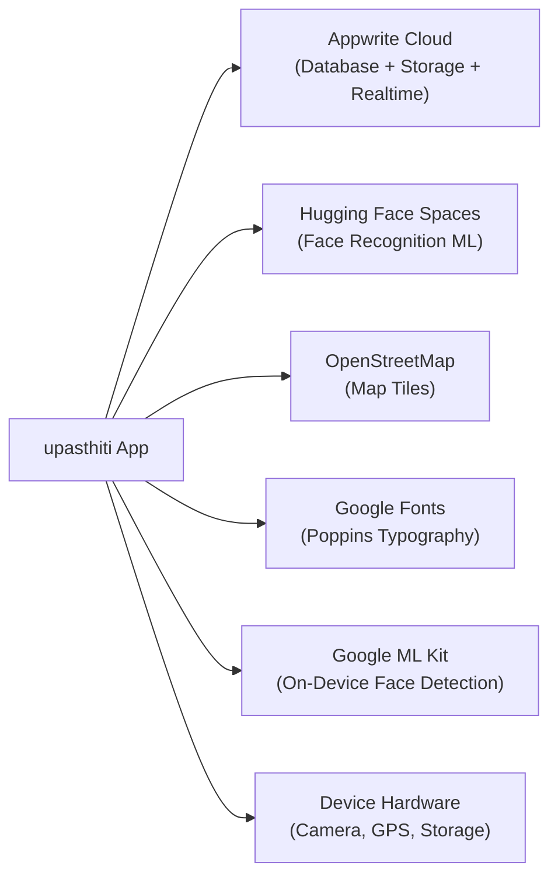

---

## 12. Deployment Architecture

### 12.1 Current Deployment Model

upasthiti's backend runs entirely on **Appwrite Cloud** in the Singapore region — a fully managed service requiring no server provisioning, patching, or scaling configuration from the development team; database schema, storage buckets, and permission policies are all configured through the Appwrite console rather than in code. Face recognition runs on **Hugging Face Spaces**, a free-tier serverless platform for Python ML applications that sleeps after inactivity and requires 30–60 seconds to wake, has no persistent-storage guarantee depending on tier, and carries no SLA — characteristics the application already mitigates client-side (Section 11.2) but which the codebase itself flags as unsuitable for a production-scale deployment. The Flutter client itself is distributed as platform-native build artifacts: an APK/AAB for Android, an IPA for iOS (via TestFlight or App Store), and an EXE installer for Windows.

### 12.2 Deployment Diagram

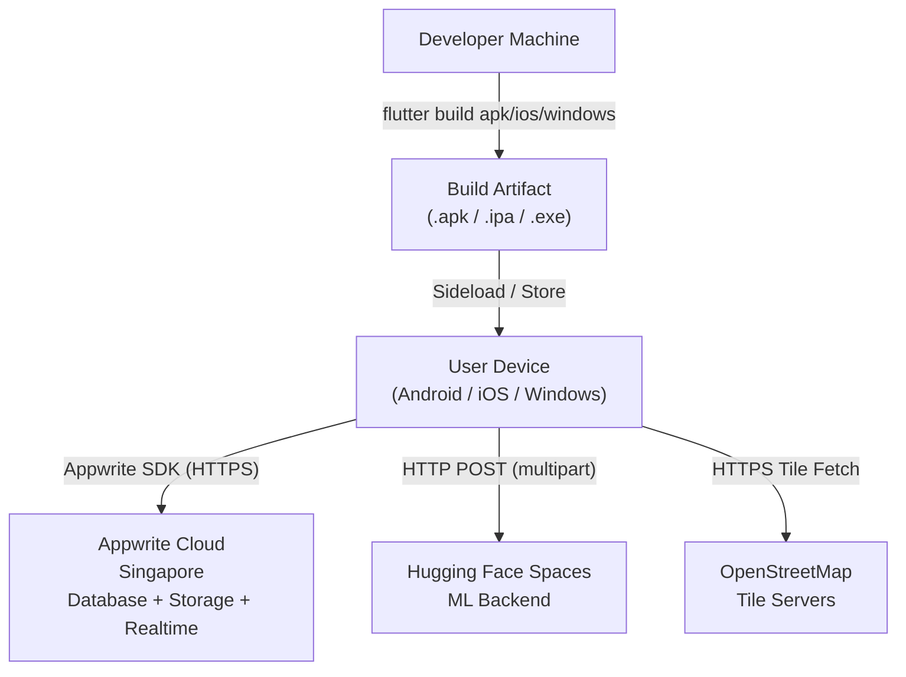

### 12.3 Build Process

| Platform | Build Command | Distribution Channel |
|---|---|---|
| Android (APK) | `flutter build apk --release` | Direct sideload |
| Android (AAB) | `flutter build appbundle --release` | Google Play Store |
| iOS | `flutter build ios --release` | TestFlight (beta) or App Store |
| Windows | `flutter build windows --release` | Standalone `.exe` installer or Microsoft Store |

App icons are generated via `flutter_launcher_icons: ^0.14.3`, sourced from `assets/appLogo.png` for Android, iOS, and Windows (48px). The splash-screen and admin-portal logo asset is `assets/upasthiti.png`.

### 12.4 App Configuration

At present, **all environment values — the Appwrite project ID, database ID, storage bucket IDs, and the ML backend base URL — are hardcoded directly inside `AppwriteService`**, with no `.env` file or build-flavor separation between development, staging, and production. This keeps the current single-environment pilot simple to build and run, but it means any environment change (e.g., pointing at a different Appwrite project) requires a source-code edit and rebuild.

> [!IMPORTANT]
> The recommended path forward is to adopt `--dart-define` build arguments or an equivalent build-time configuration/injection step, so that development, staging, and production builds can be produced from the same source tree without editing `AppwriteService` directly. This also reduces the risk noted in Section 10.6 of a leaked APK directly exposing the live project ID.

### 12.5 Infrastructure Gaps

| Gap | Impact |
|---|---|
| No CI/CD pipeline | Manual builds; no automated quality gates |
| No staging environment | All testing is done against the production backend |
| No error monitoring (Sentry, Firebase Crashlytics) | Runtime errors and crashes go undetected |
| No analytics (Firebase Analytics, Mixpanel) | No usage metrics or funnel visibility |
| No environment configuration system | Environment changes require code edits |
| No Appwrite Functions | No server-side business logic enforcement |
| ML backend on free-tier Hugging Face | Cold starts; no SLA; not production-grade |

---

## 13. Testing & Quality

### 13.1 Current Testing Status

Based on a complete review of the repository, **no automated tests exist beyond the default Flutter test scaffold** (`test/widget_test.dart`, an unmodified placeholder). `flutter_lints: ^6.0.0` is configured as a dev dependency and provides a standard set of static-analysis rules — enforcing correct `const` usage, single-quote string preference, unused-variable detection, `avoid_print`, and correct async/await patterns — so the codebase is linted on every build even though it carries no functional test coverage.

### 13.2 Critical Manual Test Scenarios

The following scenarios represent the highest-priority manual test cases given the absence of automation, organised by domain:

| Domain | Critical Scenarios |
|---|---|
| Authentication | Valid hashed-password login; valid plaintext (legacy) login with hash-upgrade verification; invalid credential rejection; wrong-role portal rejection; pending-account gate; CAPTCHA rejection; forgot-password correct/incorrect answer; Dean 5-tap gesture timing |
| Attendance | Mark within time window; block outside time window; block outside geofence; block on face-verification failure; retry handling when ML service is cold; correct DB document on success; photo lands in the correct bucket |
| Leave | Request routed to the correct approver; approval/rejection updates status correctly; no-approver-found error message |
| Distribution | Event created as draft; recipients added individually and via Excel import; QR scan marks issued; duplicate scan returns warning; ineligible-student scan returns warning; student acknowledgement updates status |
| Admin Operations | Class creation with and without geofence; L2/L3 assignment to a class; student registration approval/rejection; org chart renders the correct hierarchy |

### 13.3 Recommended Testing Strategy

A production-grade testing pyramid for upasthiti would build up through four tiers:

- **Unit Tests** — `AppwriteService.hashPassword()`/`verifyPassword()`; `AdminHierarchyService.readAssignments()` across boundary JSON variants; `AdminHierarchyService.resolveApprovers()` across level combinations; `DistributionService.encodeQr()`/`decodeQr()` round-trip; `LeaveService` CRUD against a mocked Appwrite client.
- **Widget Tests** — `LoginPage` form validation and submission flow; `LeaveRequestPage` field validation; `UserAvatar` rendering with and without a photo ID; `AdminLevelSelectPage` card-tap navigation.
- **Integration Tests** — Full attendance-marking flow against a mocked ML backend and mocked Appwrite; full registration flow; distribution scan flow against a mocked Appwrite client.
- **End-to-End Tests** — Flutter integration tests run against a dedicated test Appwrite project, with the ML backend exercised using sample face images.

> [!WARNING]
> No CI/CD configuration exists in the repository (no GitHub Actions, Bitrise, Fastlane, Dockerfile, or Kubernetes manifests). Builds are currently produced manually from a developer machine, which Section 15.1 flags as a P1 priority to resolve.

---

## 14. Scalability Analysis

### 14.1 Current Architecture Constraints

upasthiti runs on a single Appwrite Cloud project holding every collection, with all screen state managed client-side via `setState` and no external state manager, no caching layer, and no background job system. These are entirely reasonable choices for a pilot/MVP deployment, but they impose specific limits as usage grows, detailed below.

### 14.2 Bottleneck Analysis

| Bottleneck | Current Behaviour | Recommended Fix |
|---|---|---|
| **Attendance log volume** | Admin logs tab fetches up to 500 logs per class in a single call; some aggregation queries fetch 1,000+ documents; query time grows linearly with volume | Server-side aggregation via Appwrite Functions or a dedicated daily-summary analytics collection |
| **`studentIds` array in classes** | Enrollment stored as an in-document array; Appwrite document size limits and query performance degrade as class size grows into the hundreds | Replace with a `class_enrollments` junction collection (one document per student-class pair) |
| **ML backend cold starts** | Hugging Face Spaces sleeps after inactivity; first attendance mark after a cold period can take 30–90 seconds end-to-end from the user's perspective | Move ML inference to a persistent, dedicated server (GPU VM, AWS SageMaker, Google Vertex AI) with a keep-alive ping |
| **Realtime subscription coarseness** | All subscriptions listen to the entire collection; any change anywhere triggers a full re-fetch, even for admins in unrelated departments | Use query-scoped Realtime (where available) or filter events client-side on the `RealtimeMessage.payload` |
| **No background job infrastructure** | Account cleanup, report generation, and aggregation all run synchronously on the client during normal app operation | Implement Appwrite Functions for scheduled cleanup, summary pre-computation, and notification dispatch |

Already-implemented mitigation: cursor-based pagination (`Query.cursorAfter(lastDocId)`) is in active use in the admin logs tab, fetching 50 records at a time with infinite scroll — a partial answer to the log-volume bottleneck that does not yet extend to every heavy query in the app.

### 14.3 Capacity Estimates

| Metric | Comfortable Range | Concern Point |
|---|---|---|
| Concurrent users | Up to ~1,000 | Beyond 1,000, Realtime WebSocket connections may require a plan upgrade |
| Classes per institution | Up to ~500 | No hard limit; query performance degrades beyond ~1,000 documents without indexes |
| Attendance logs | Up to ~100,000 | Beyond this, without pagination, initial loads become slow |
| Students per class | Up to ~200 (array limit) | Array-based enrollment list; beyond 200 needs a schema change |
| Distribution events | Unlimited | No identified scaling issue |

Appwrite Cloud scales horizontally for reads transparently; the ML backend is the system's **single point of failure**, currently running as a single instance with no horizontal scaling.

### 14.4 Scalability Roadmap

| Horizon | Priorities |
|---|---|
| **Near-term (0–3 months)** | Replace `studentIds` array with a junction collection; add Appwrite indexes on frequently-queried fields (timestamp, classId, userId, status); implement server-side log aggregation via an Appwrite Function |
| **Medium-term (3–6 months)** | Migrate the ML backend to persistent hosting; add a Redis or in-memory caching layer for frequently-read reference data (department lists, class metadata); implement push notifications in place of always-on Realtime for leave approvals and class notifications |
| **Long-term (6–12 months)** | Multi-tenant architecture supporting multiple independent institutions on one deployment; a dedicated analytics database with pre-computed aggregates; an Appwrite self-hosted deployment with custom hardware for compliance-sensitive institutions |

---

## 15. Future Roadmap

### 15.1 P0 — Critical (Production Readiness)

| Item | Recommendation |
|---|---|
| Move business logic server-side | Implement an Appwrite Function to validate attendance submissions (time, geofence, face) server-side before writing the log |
| Upgrade ML backend hosting | Migrate face recognition to a dedicated GPU instance or managed inference platform (SageMaker, Vertex AI, or a self-hosted FastAPI/Triton server) |
| Add error monitoring | Integrate Firebase Crashlytics or Sentry for automatic crash and error reporting |
| Implement environment configuration | Use `--dart-define` build arguments or a `.env` generation step to separate dev/staging/production |

### 15.2 P1 — High Priority (Security & Reliability)

| Item | Recommendation |
|---|---|
| Hash security answers | Apply PBKDF2 or bcrypt to security-question answers before storage |
| Add server-side rate limiting | Implement login rate limiting via Appwrite Functions or a WAF |
| HMAC-sign QR codes | Sign distribution QR payloads with a keyed hash and short expiry to prevent screenshot-sharing |
| Replace `studentIds` array | Migrate to a `class_enrollments` junction collection |
| Add a CI/CD pipeline | GitHub Actions for lint checks on every PR, automated builds on merge, and automated test execution |

### 15.3 P2 — Important (Feature Enhancements)

| Item | Recommendation |
|---|---|
| Push notifications | Integrate Firebase Cloud Messaging so leave/class notifications reach users when the app is closed |
| Biometric / PIN lock | Add re-authentication (fingerprint/FaceID) for high-sensitivity admin actions |
| Offline mode | Local-first attendance queuing (`sqflite`/`Hive`) with server-side duplicate detection on sync |
| Multi-tenant support | Add an `institutionId` field across collections and a top-level institution selector |
| Attendance period scheduling | Allow recurring schedules (e.g., Mon/Wed/Fri 9–10) instead of manual period creation |
| Report scheduling | Allow admins to schedule automatically generated and emailed weekly/monthly reports |

### 15.4 P3 — Nice to Have

| Item | Description |
|---|---|
| Student attendance percentage widget | Visual ring/pie indicator of overall attendance rate on the student home page |
| Admin dashboard analytics charts | Interactive bar/line charts (`fl_chart`/`syncfusion_flutter_charts`) replacing plain lists |
| Dark mode toggle for students | User-toggleable light/dark mode instead of a forced dark theme |
| Notification preferences | Configurable notification categories per user |
| In-app feedback / bug reporting | Built-in feedback form for field users |
| Export scheduling and auto-email | Scheduled export emails for HR/Office Admins (requires an email service integration) |
| Attendance calendar view | Month-view calendar of per-day attendance status |

### 15.5 Technical Debt Register

| Item | Location | Effort |
|---|---|---|
| `admin_home_page.dart` is 4,000+ lines | `lib/admin_home_page.dart` | Medium — split into feature files |
| Hardcoded department list (8 options) | `register_page.dart` | Small — make configurable per institution |
| No error telemetry | Entire app | Small — add Sentry/Crashlytics |
| Double-storage of admin assignments (boundary JSON + top-level fields) | `admin_hierarchy_service.dart` | Medium — unify storage to top-level fields |
| `_kDb` constant duplicated across multiple files | Multiple admin pages | Small — reference `AppwriteService.databaseId` everywhere |
| Plaintext security answers | `profile_page.dart`, `forgot_password_page.dart` | Small — add hashing |
| No loading skeleton on initial page fetch | Multiple screens | Small — add shimmer loading states |

---

## 16. Appendix

### A. Collection Reference

| Collection | ID (Name) | Primary Purpose |
|---|---|---|
| Users | `users` | All user accounts (students + all admin types) |
| Classes | `classes` | Attendance class/session groups |
| Attendance Logs | `attendance_logs` | Immutable attendance marking records |
| Leave Requests | `leave_requests` | Employee/admin leave applications |
| Community Messages | `community_messages` | Class-scoped messages (broadcast + DM) |
| Distribution Events | `distribution_events` | Resource distribution event records |
| Event Recipients | `event_recipients` | Per-student per-event distribution tracking |
| Event Admin Assignments | `event_admin_assignments` | QR scanner admin assignments per event |
| Distribution Scan Logs | `distribution_scan_logs` | Immutable QR scan attempt records |

### B. Storage Buckets Reference

| Bucket | ID | Contents |
|---|---|---|
| Profile Photos | `6a2c12a500260c940843` | User selfies taken at registration |
| Attendance Photos | `attendance_photos` | Live verification photos per attendance mark |
| Community Files | `community_files` | File attachments in class community chat |

### C. Admin Role Reference

| Role Token | Display Name | Level Field | Portal |
|---|---|---|---|
| `student` | Student / Employee | N/A | Home Page |
| `admin` | Admin (Institution) | 1 | AdminHomePage |
| `admin` | Admin (Dept. Head) | 2 | AdminHomePage |
| `admin` | Admin (Team Leader) | 3 | AdminHomePage |
| `officeAdmin` | Office Admin | N/A | OfficeAdminHomePage |
| `eventAdmin` | Event Admin | N/A | EventAdminHomePage |
| `hrAdmin` | HR Admin | N/A | HrAdminHomePage |
| `securityAdmin` | Security Admin | N/A | SecurityAdminHomePage |
| `dean` | Super Admin | N/A | DeanHomePage |

### D. Leave Request Status States

| Status | Meaning |
|---|---|
| `pending` | Submitted; awaiting approver action |
| `approved` | Approver has granted the leave |
| `rejected` | Approver has denied the leave |

### E. Attendance Log Status States

| `adminVerifiedStatus` | Meaning |
|---|---|
| `Pending` | Submitted by student; not yet reviewed by admin |
| `Present` | Admin confirmed the student was present |
| `Verified` | Alternate form of Present (treated equivalently) |
| `Absent` | Admin marked the student as absent |

### F. Distribution Event Status States

| Status | Meaning |
|---|---|
| `draft` | Being configured; not visible to scanner admins |
| `active` | Open for QR scanning; visible on the recipient's QR page |
| `closed` | Distribution complete; no further scanning allowed |

### G. Distribution Recipient Status States

| Status | Meaning |
|---|---|
| `pending` | Registered; item not yet issued |
| `issued` | QR scanned; item handed over; awaiting acknowledgement |
| `acknowledged` | Student confirmed receipt via "Got it" |
| `revoked` | Recipient removed from event |

### H. Distribution Scan Actions

| Action | Meaning |
|---|---|
| `issued` | Successful distribution; item marked as issued |
| `duplicate_attempt` | Student already received item; second scan blocked |
| `ineligible` | Scanned user is not on the recipient list |
| `revoked` | Student's eligibility was revoked before scanning |
| `manual_override` | Admin manually overrode a prior status |

### I. Geofence Boundary JSON Schema

```json
{
  "lat": 18.52043,
  "lng": 73.85674,
  "radiusMeters": 150,
  "headAdminId": "admin_user_123",
  "headAdminName": "John Doe",
  "supervisorId": "admin_user_456",
  "supervisorName": "Jane Smith"
}
```

The geographic fields (`lat`, `lng`, `radiusMeters`) and the admin assignment fields (`headAdminId`, `headAdminName`, `supervisorId`, `supervisorName`) coexist in the same JSON object stored in the class `boundary` field, separated at read time by `AdminHierarchyService.geoFromBoundary()` and `readAssignments()`.

### J. QR Code Payload Format

Distribution QR codes currently encode the student's `username` directly as a plain string; `DistributionService.encodeQr()` returns the username unchanged. As noted in Sections 10.6 and 15.2, future versions should add HMAC signing to prevent QR codes from being screenshotted and shared for proxy collection.

### K. Key File Sizes

| File | Lines | Bytes | Notes |
|---|---|---|---|
| `admin_home_page.dart` | 4,036 | 167 KB | Largest file; candidate for splitting |
| `dean_home_page.dart` | 2,351 | 92 KB | Second largest |
| `distribution/admin_distribution_tab.dart` | 1,968 | 70 KB | Distribution admin UI |
| `hr_admin_home_page.dart` | 1,448 | 49 KB | HR Admin portal |
| `security_admin_home_page.dart` | 1,200 | 40 KB | Security Admin portal |
| `services/admin_hierarchy_service.dart` | 507 | 16 KB | Hierarchy logic |
| `services/distribution_service.dart` | 493 | 15 KB | Distribution CRUD |

---

Prepared by Navonmesh Samadhan LLP | upasthiti v0.1.0 | Confidential
