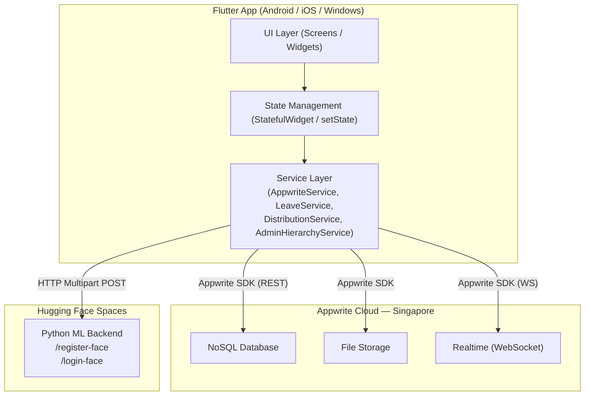

# 05 — System Architecture

## Architecture Style
**Decoupled Client-BaaS (Backend-as-a-Service)** with an external ML microservice.

The Flutter application is a thick client that handles all UI logic, local state, and business rule evaluation. All persistent data operations are delegated to Appwrite. AI inference is delegated to a Hugging Face Spaces microservice. There is no custom REST API server — Appwrite is the sole backend.

---

## High-Level Component Diagram



---

## Application Layers

### UI Layer
All screens are `StatefulWidget` classes. Flutter's widget tree is the rendering engine. Navigation uses `Navigator.push` / `Navigator.pushReplacement`. Page-to-page transitions use custom `PageRouteBuilder` with slide + fade animations (320–400 ms). The `AnimatedSwitcher` widget handles in-tab content transitions.

### State Management
State is managed locally using Flutter's built-in `StatefulWidget` + `setState` pattern. There is no external state management library (no Provider, Riverpod, Bloc, etc.). Each screen manages its own data lifecycle. Realtime data is pushed into state via Appwrite WebSocket listeners (`RealtimeSubscription.stream.listen`).

### Service Layer
Four service singletons abstract all backend logic:
- `AppwriteService` — Appwrite SDK initialisation, password hashing/verification, inactive account cleanup.
- `LeaveService` — CRUD for the `leave_requests` collection.
- `DistributionService` — CRUD for distribution events, recipients, scan logs, and QR encoding/decoding.
- `AdminHierarchyService` — Resolves admin hierarchy relationships from class `boundary` JSON, resolves leave approvers, lists admins by level.

### Backend (Appwrite)
Appwrite Cloud (Singapore region, `sgp.cloud.appwrite.io`) hosts:
- **Databases**: A single database (`6a2c10dc000d5e50f314`) with multiple collections.
- **Storage**: Three buckets (profile photos, attendance photos, community files).
- **Realtime**: WebSocket connections for live data push.

### ML Backend (Hugging Face Spaces)
A Python microservice (`pasteshub404-navikarana-backend.hf.space`) accepts:
- `POST /register-face` — multipart form with `username` + image file → stores embedding.
- `POST /login-face` — multipart form with `username` + image file → returns `{"verified": true}`.

---

## Data Flow: Attendance Marking

```
Student taps "Mark Attendance"
  │
  ▼
[1] Check active period (Appwrite DB query on classes)
  │
  ▼
[2] Get GPS (device geolocator)
  │
  ▼
[3] Compute Haversine distance
      → if > radius: STOP
  │
  ▼
[4] Open camera → capture photo
  │
  ▼
[5] POST photo + username to HF ML backend
      → if not verified: STOP
  │
  ▼
[6] Upload photo to Appwrite Storage (attendance_photos)
  │
  ▼
[7] Create document in attendance_logs collection
  │
  ▼
[8] Admin's realtime subscription fires → log appears in admin feed
```

---

## Realtime Architecture

Appwrite Realtime uses WebSocket connections. The Flutter `Realtime` SDK provides `subscribe()` which returns a `RealtimeSubscription`. The `.stream` property is a Dart `Stream<RealtimeMessage>` that emits events on any change to the subscribed collection.

Subscriptions are established in `initState()` and cancelled in `dispose()` to prevent memory/connection leaks.

Active Realtime subscriptions in production code:

| Screen | Collection Subscribed | Trigger |
|---|---|---|
| `HomePage` | `classes` | Student home refreshes on any class change |
| `AdminHomePage` | `attendance_logs` | Admin logs tab refreshes on new log |
| `AdminApprovalRequestsPage` | `users` | New pending registrations appear instantly |
| `CommunityPage` | `community_messages` | New messages delivered live |
| `AdminDistributionTab` | `distribution_events` | Event status changes propagate immediately |

---

## Folder Responsibilities

```
lib/
├── main.dart                    ← App entry, splash, route guard
├── app_theme.dart               ← Global theme tokens and reusable decorations
├── register_page.dart           ← Student registration with face + GPS
├── home_page.dart               ← Student home (realtime classes)
├── class_detail_page.dart       ← Attendance marking, leave entry, community link
├── community_page.dart          ← Messaging (channel + DM)
├── profile_page.dart            ← Password change, security Q&A update
├── forgot_password_page.dart    ← 3-step self-service recovery
├── leave_request_page.dart      ← Leave submission form
├── admin_login.dart             ← Shared admin login with CAPTCHA
├── admin_level_select_page.dart ← Role/level selector before admin login
├── admin_home_page.dart         ← L1/L2/L3 unified admin portal (~4000 lines)
├── admin_org_chart_page.dart    ← Organisational chart
├── admin_approval_requests_page.dart ← Student approval queue
├── admin_hierarchy_views.dart   ← L1/L2/L3 shared hierarchy components
├── office_admin_home_page.dart  ← Office Admin portal
├── office_admin_student_attendance_page.dart ← Per-student attendance viewer
├── hr_admin_home_page.dart      ← HR Admin portal
├── security_admin_home_page.dart ← Security Admin portal
├── event_admin_home_page.dart   ← Event Admin portal
├── dean_home_page.dart          ← Dean/Super Admin portal (~2350 lines)
├── dean_login.dart              ← Dean-specific login screen
├── admin_level_select_page.dart ← Portal role selection
├── services/
│   ├── appwrite_service.dart    ← SDK singleton, password hashing, cleanup
│   ├── leave_service.dart       ← Leave request CRUD
│   ├── distribution_service.dart ← Distribution event + scan CRUD
│   └── admin_hierarchy_service.dart ← Hierarchy resolution logic
├── distribution/
│   ├── admin_distribution_tab.dart ← Admin-side event management UI
│   ├── admin_scan_page.dart     ← QR scanner kiosk
│   ├── dean_distribution_tab.dart  ← Dean-level distribution management
│   └── user_qr_page.dart        ← Student QR code + active packages
└── components/
    └── user_avatar.dart         ← Profile photo / initials fallback widget
```
