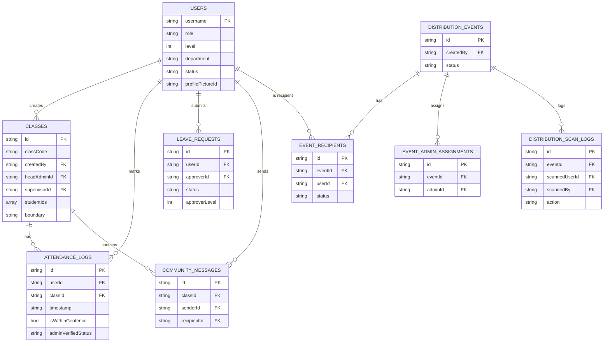

# 08 — Database Design

## Database Provider
**Appwrite NoSQL** (document-based, JSON). A single database with ID `6a2c10dc000d5e50f314`.

Appwrite does not use traditional SQL relationships. Documents reference each other by ID strings. There are no foreign key constraints or join operations — these are handled in application code by making sequential queries.

---

## Collections

### `users`
Stores all user accounts: students, admins of all types, and the Dean.

| Field | Type | Description |
|---|---|---|
| `username` | String | Unique login identifier; used as the primary lookup key |
| `name` | String | Display name |
| `password` | String | SHA-256 hash (or plaintext for legacy accounts during migration) |
| `role` | String | `student`, `admin`, `officeAdmin`, `eventAdmin`, `hrAdmin`, `securityAdmin`, `dean` |
| `level` | Integer | For `admin` role: 1 (Institution), 2 (Department), 3 (Team Leader); null for others |
| `department` | String | Department or school affiliation |
| `status` | String | `pending` (awaiting approval) or `active` (approved) |
| `profilePictureId` | String? | Appwrite Storage file ID for profile photo |
| `latitude` | Double? | Registered location latitude (captured at registration) |
| `longitude` | Double? | Registered location longitude |
| `securityQuestion` | String? | Selected security question for password recovery |
| `securityAnswer` | String? | Answer to security question |
| `lastLogin` | String? | ISO-8601 timestamp of most recent login |

**Indexes required (inferred)**: `username` (unique, for login lookup); `role` (for admin portal queries); `department` (for departmental filtering); `status` (for approval queue filtering); `lastLogin` (for cleanup queries).

---

### `classes`
Represents an attendance class or session group.

| Field | Type | Description |
|---|---|---|
| `className` | String | Human-readable class name |
| `classCode` | String | Join code (unique identifier shown on class cards) |
| `adminName` | String | Display name of the creating admin |
| `createdBy` | String | `username` of the admin who created the class |
| `studentIds` | Array\<String\> | List of enrolled student usernames |
| `boundary` | String (JSON) | Serialised JSON containing geofence data AND admin assignment metadata |
| `actingAs` | String? | Set to `"dean"` when a Dean creates a class, for audit purposes |
| `headAdminId` | String? | Level 3 admin assigned as class head (mirrored from boundary JSON) |
| `headAdminName` | String? | Display name of Level 3 head admin |
| `supervisorId` | String? | Level 2 admin assigned as supervisor (mirrored from boundary JSON) |
| `supervisorName` | String? | Display name of Level 2 supervisor |
| `joinRequests` | Array\<String\>? | Student usernames who have requested to join |
| `rejectedStudents` | Array\<String\>? | Student usernames whose join requests were rejected |

**Note on `boundary` field**: This single JSON string serves a dual purpose — it stores both the geographic boundary (`lat`, `lng`, `radiusMeters`) and the admin assignment metadata (`headAdminId`, `headAdminName`, `supervisorId`, `supervisorName`). The `AdminHierarchyService.geoFromBoundary()` and `readAssignments()` methods parse and separate these two concerns.

---

### `attendance_logs`
An append-only record of every attendance marking attempt.

| Field | Type | Description |
|---|---|---|
| `userId` | String | `username` of the student who marked attendance |
| `userName` | String | Display name of the student |
| `classId` | String | Appwrite document `$id` of the class |
| `className` | String | Class name (denormalised for display) |
| `periodId` | String? | Identifier of the active attendance period |
| `timestamp` | String | ISO-8601 datetime of the mark |
| `photoUrl` | String? | Direct URL to the verification photo in Appwrite Storage |
| `adminVerifiedStatus` | String | `Pending`, `Present`, `Verified`, or `Absent` |
| `isWithinGeofence` | Boolean | Whether the GPS check passed |
| `isHiddenFromAdmin` | Boolean? | Soft-delete flag; true hides this log from admin views |

---

### `leave_requests`
Stores leave applications from employees/students and admins.

| Field | Type | Description |
|---|---|---|
| `userId` | String | `username` of the person requesting leave |
| `userName` | String | Display name |
| `leaveType` | String | `Medical`, `Casual`, `Paid leave`, or `LTC - tour leave` |
| `startDate` | String | ISO-8601 start date |
| `endDate` | String | ISO-8601 end date |
| `reason` | String | Written justification (up to 500 chars) |
| `status` | String | `pending`, `approved`, or `rejected` |
| `approverLevel` | Integer | Level of the admin who should approve (requester level - 1) |
| `approverId` | String? | Specific admin username targeted as approver |
| `createdAt` | String | ISO-8601 creation timestamp |
| `actionBy` | String? | Display name of admin who actioned the request |
| `actionById` | String? | `username` of admin who actioned the request |

---

### `community_messages`
Messages within class community channels and DMs.

| Field | Type | Description |
|---|---|---|
| `classId` | String | The class this message belongs to |
| `senderId` | String | `username` of message sender |
| `senderName` | String | Display name |
| `isAdmin` | Boolean | Whether the sender is an admin (affects display styling) |
| `message` | String | Text content |
| `attachmentId` | String? | Appwrite Storage file ID if a file was attached |
| `attachmentName` | String? | Original filename of attachment |
| `timestamp` | String | ISO-8601 timestamp |
| `recipientId` | String? | If present, this is a DM; only sender and this recipient see the message |

---

### `distribution_events`
Distribution event records.

| Field | Type | Description |
|---|---|---|
| `title` | String | Event name |
| `description` | String | Event details |
| `scheduledDate` | String | ISO-8601 planned date |
| `location` | String | Physical location |
| `status` | String | `draft`, `active`, or `closed` |
| `createdBy` | String | Admin username |
| `issuedCount` | Integer | Running count of issued items |
| `totalRecipients` | Integer | Total number of registered recipients |
| `createdAt` | String | Creation timestamp |

---

### `event_recipients`
One record per student per event.

| Field | Type | Description |
|---|---|---|
| `eventId` | String | Links to `distribution_events` document |
| `userId` | String | Student `username` |
| `userName` | String | Student display name |
| `status` | String | `pending`, `issued`, `acknowledged`, or `revoked` |
| `issuedAt` | String? | ISO-8601 timestamp when item was scanned-out |
| `issuedBy` | String? | Admin username who scanned |
| `acknowledgedAt` | String? | ISO-8601 timestamp when student confirmed receipt |
| `packageNote` | String? | Optional note about the package |

---

### `event_admin_assignments`
Maps authorised scanner admins to specific events.

| Field | Type | Description |
|---|---|---|
| `eventId` | String | Links to `distribution_events` |
| `adminId` | String | Admin username |
| `adminName` | String | Admin display name |
| `assignedBy` | String | Username of assigning admin |
| `assignedAt` | String | ISO-8601 timestamp |
| `isActive` | Boolean | Whether this assignment is currently active |

---

### `distribution_scan_logs`
Immutable log of every QR scan attempt.

| Field | Type | Description |
|---|---|---|
| `eventId` | String | Links to `distribution_events` |
| `scannedUserId` | String | Student username found in QR code |
| `scannedBy` | String | Admin username who performed the scan |
| `action` | String | `issued`, `duplicate_attempt`, `ineligible`, `revoked`, `manual_override` |
| `timestamp` | String | ISO-8601 timestamp |

---

## Storage Buckets

| Bucket | ID | Contents | Access |
|---|---|---|---|
| Profile Photos | `6a2c12a500260c940843` | User profile photos (registration selfies) | Read by authenticated app users |
| Attendance Photos | `attendance_photos` | Live verification photos (one per attendance mark) | Write-once during attendance; readable for audit |
| Community Files | `community_files` | File attachments from community chat | Read/write by class members |

---

## Entity Relationship Overview (Logical)

