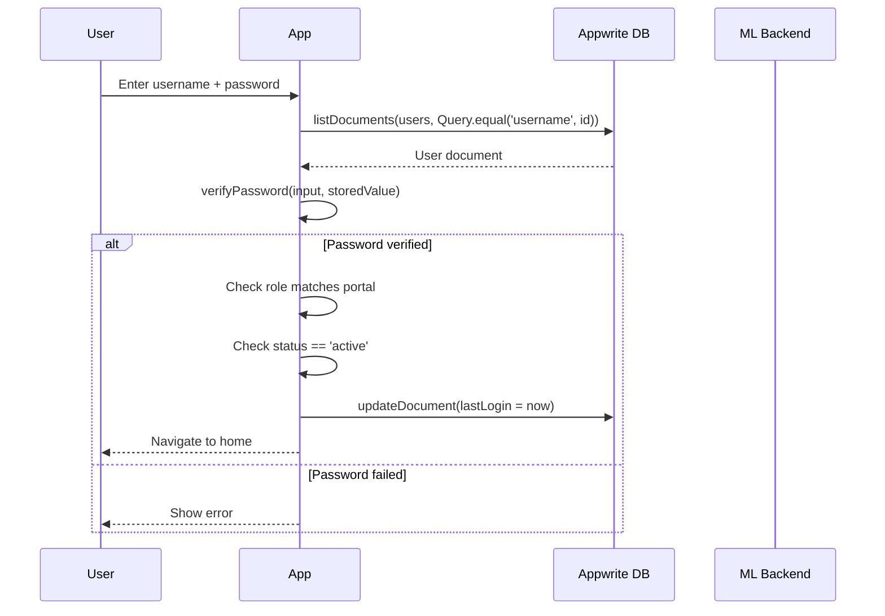

# 10 — Authentication & Authorization

## Authentication Model

upasthiti implements a **custom credential-based authentication system** built on top of Appwrite's Databases SDK. It does not use Appwrite's built-in Auth service (`Account` API). Instead, user credentials are stored in a `users` collection and verified client-side.

---

## Authentication Flow

---

## Password Security

### SHA-256 Hashing
All new passwords are hashed using SHA-256 (via the Dart `crypto` package) before being stored. The hash is produced from the UTF-8 encoding of the plaintext and stored as a 64-character hex string.

### Dual-Mode Verifier
`AppwriteService.verifyPassword(inputPlaintext, storedValue)` implements a dual-mode check:
1. If `storedValue` matches the regex `^[a-f0-9]{64}$` (i.e., is a SHA-256 hash), the input is hashed and compared.
2. If `storedValue` does not match the pattern (plaintext legacy account), the raw input is compared directly.

On successful login with a plaintext password, the system immediately upgrades the stored value to a hash — enabling transparent, zero-downtime migration from plaintext to hashed credentials.

---

## Admin Login CAPTCHA

Before any admin login attempt can be submitted, the user must solve a randomly generated arithmetic CAPTCHA (e.g., `7 + 4 = ?`). The CAPTCHA:
- Is regenerated fresh on every page load.
- Can be refreshed manually.
- Must be answered correctly before the credential fields are even enabled.

This is an additional layer that specifically targets admin accounts, which are higher-value targets for brute-force or scripted login attempts.

---

## Session Management

upasthiti does not use HTTP sessions, JWT tokens, or cookies. After a successful login, the app navigates to the role-appropriate home page and holds the authenticated user's `username`, `name`, `role`, `level`, and `department` in the page widget's local state. Logout clears the navigation stack back to the login page.

There is no persistent session storage (no `shared_preferences` or secure storage). Closing and reopening the app requires re-authentication.

---

## Role-Based Access Control (RBAC)

### Portal-Level Enforcement
Each admin portal is accessed through a distinct login flow:
- The `AdminLevelSelectPage` shows role/level selection cards.
- Each card navigates to `AdminLoginPage` with a `specialRole` or `requiredLevel` parameter.
- On login, the fetched user document must have a `role` field that matches the selected role, AND if a level admin, the `level` integer must match.

Example: If a user tries to log in through the Level 1 portal, but their `role == 'admin'` and `level == 3`, login is rejected with a mismatch error.

### Student Login Rejection of Admin Roles
The standard employee login screen explicitly rejects users with `role == 'admin'` or `role == 'dean'`, displaying "Unauthorized access. Use the correct portal."

### Inactive Account Gate
Users with `status == 'pending'` cannot log in. They see a message explaining their account is awaiting admin approval.

### Dean Secret Gate
The Dean login is not exposed in any menu. It requires:
1. Tapping the upasthiti logo exactly 5 times in rapid succession.
2. A "Super Admin Portal" button appears.
3. Navigating to `DeanHomePage` requires successful authentication against a user with `role == 'dean'`.

---

## Authorization Model

Authorization is enforced at the query level. Every data fetch is scoped to what the logged-in user is permitted to see:

| Role | Data Scope |
|---|---|
| Student | Only classes they are enrolled in; only their own attendance logs |
| L3 Admin | Only classes they created; only logs from those classes |
| L2 Admin | Classes assigned via hierarchy; their department's users |
| L1 Admin | All classes for all admins in their institution |
| Office Admin | All students in their department |
| HR Admin | Leave requests in their department |
| Security Admin | All attendance logs institution-wide |
| Dean | All data institution-wide |

**Note**: This scoping is enforced by the application-level queries. Appwrite's collection-level permissions are not documented in the codebase — it is unknown whether Appwrite-level permission rules provide an additional enforcement layer.

---

## Security Question Recovery

The forgot password flow authenticates the user through their security question without requiring admin involvement:

1. User provides their Unique ID.
2. `securityQuestion` is fetched from the database (not sensitive — questions are pre-defined).
3. User provides their answer. The app checks `doc.data['securityAnswer'].toLowerCase() == inputAnswer.toLowerCase()`.
4. If correct, the user can set a new password.

**Weakness**: The security answer is stored in plaintext in the database. This is a known limitation — a future improvement would be to hash the answer as well.

---

## Authentication Audit

Every successful login writes the current UTC timestamp to `lastLogin` on the user document. This enables:
- The inactive account cleanup routine to identify and remove old accounts.
- The Security Admin's Access Control tab to display last-seen information per user.
