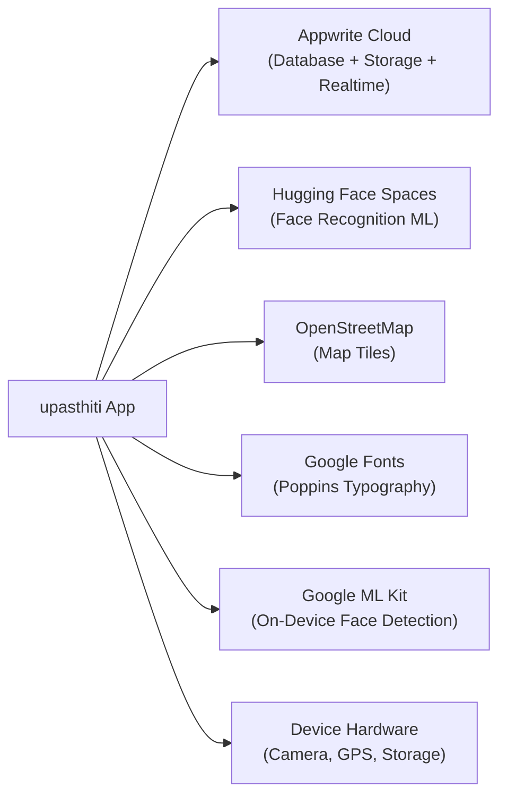

# 11 — Integrations & Third-Party Services

## 1. Appwrite Cloud

**Type**: Backend-as-a-Service (BaaS)  
**Region**: Singapore (`sgp.cloud.appwrite.io`)  
**SDK**: `appwrite: ^23.1.0`

Appwrite provides the entire backend infrastructure:

| Service | Usage |
|---|---|
| **Databases** | All document storage (users, classes, logs, leave, distribution, chat) |
| **Storage** | Three buckets for profile photos, attendance photos, community files |
| **Realtime** | WebSocket-based live data push for 5 distinct screen subscriptions |

Appwrite is the single point of data persistence for the entire application. The Flutter app communicates with it exclusively through the official Dart SDK.

---

## 2. Hugging Face Spaces — ML Backend

**Type**: Python ML inference microservice  
**Platform**: Hugging Face Spaces (free tier, serverless)  
**Base URL**: `https://pasteshub404-navikarana-backend.hf.space`

The ML backend handles face recognition:
- **Embedding Storage**: Registers and stores face embeddings indexed by username.
- **Verification**: Compares a submitted photo against the stored embedding.

**Limitations of current setup**:
- Hugging Face Spaces free tier may sleep after inactivity — the app's 3-attempt retry with cold-start backoff mitigates this.
- No SLA, uptime guarantee, or regional redundancy.
- This is a development/MVP deployment. Production use would require a dedicated hosted inference service.

---

## 3. OpenStreetMap (via flutter_map)

**Type**: Tile map service  
**SDK**: `flutter_map: ^8.2.2` + `latlong2: ^0.9.1`

Used in the geofence boundary picker dialog. The map loads tiles from:
```
https://tile.openstreetmap.org/{z}/{x}/{y}.png
```

OpenStreetMap tiles are used at zoom level 16 for the boundary picker. No API key is required. This is a free, open-source map service. Tile usage in a production app at scale may require attribution and compliance with OSM's tile usage policy.

---

## 4. Google Fonts

**SDK**: `google_fonts: ^6.2.1`

Poppins font is loaded from Google Fonts CDN at runtime. All text in the application uses `GoogleFonts.poppins()`. This requires internet access on first launch to download font assets; subsequent launches use the cached version.

---

## 5. Google ML Kit — Face Detection

**SDK**: `google_mlkit_face_detection: ^0.11.0`

On-device face detection is used as a pre-validation step before sending the photo to the remote ML backend. This avoids unnecessary API calls when no face is detected in the captured image (e.g., if the user accidentally captured a blank frame).

This runs entirely on-device using Google's bundled ML model — no API key or network call required.

---

## 6. Device Hardware Integrations

| Hardware | Package | Usage |
|---|---|---|
| **Camera** | `camera: ^0.11.3` | Low-level camera stream for attendance capture |
| **Image Picker** | `image_picker: ^1.0.7` | High-level photo capture (mobile) and gallery selection |
| **File Picker** | `file_picker: ^10.3.8` | Select any file for community attachment; select Excel for recipient import |
| **GPS / Geolocator** | `geolocator: ^10.1.0` | Device location for geofence validation |
| **QR Scanner** | `mobile_scanner: ^5.2.3` | Camera-based QR code scanning for distribution kiosk |
| **Permission Handler** | `permission_handler: ^12.0.1` | Request camera, storage, location permissions at runtime |

---

## 7. Export / Generation Libraries

| Library | Package | Usage |
|---|---|---|
| **PDF** | `pdf: ^3.12.0` + `printing: ^5.14.3` | Generate formatted attendance PDF reports |
| **Excel** | `excel: ^4.0.6` | Create XLSX workbooks; also parse Excel files for recipient import |
| **CSV** | `csv: ^6.0.0` | Generate CSV attendance and leave exports |

All export is generated on-device. Files are saved to the device's documents directory via `path_provider: ^2.1.5`.

---

## 8. Desktop Platform Integrations

| Package | Platform | Usage |
|---|---|---|
| `desktop_multi_window: ^0.3.0` | Windows | Multi-window management for Windows desktop |
| `webview_windows: ^0.4.0` | Windows | WebView rendering on Windows |
| `webview_flutter: ^4.13.1` | Android/iOS | In-app web content rendering |
| `url_launcher: ^6.3.2` | All | Open external URLs; used for Windows camera workaround (opens camera.html) |

---

## Integration Dependency Map


