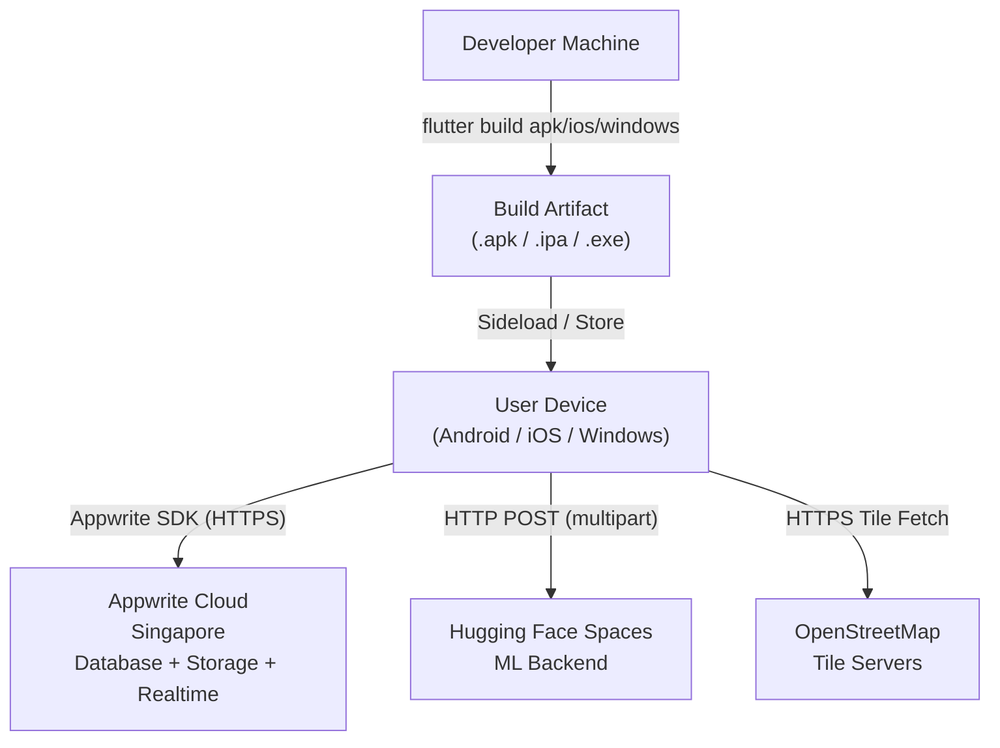

# 14 — Deployment

## Current Deployment Model

upasthiti is deployed as a **Flutter mobile application** with a **managed cloud backend**. No custom server deployment is required for the backend.

---

## Backend Deployment (Appwrite Cloud)

The Appwrite backend is hosted on **Appwrite Cloud** (Singapore region). This is a fully managed service — no server provisioning, patching, or scaling configuration is required from the development team.

**Appwrite Cloud handles**:
- Database hosting and replication
- File storage (S3-compatible)
- Realtime WebSocket infrastructure
- SSL/TLS termination
- Automatic backups (depending on plan)

The project is configured in the Appwrite console (not in code). Database collections, storage buckets, and permission policies are managed via the Appwrite web dashboard.

---

## ML Backend Deployment (Hugging Face Spaces)

The face recognition service is deployed on **Hugging Face Spaces**, a free hosting platform for ML applications. 

**Current deployment characteristics**:
- **Serverless / sleep-on-idle**: The service sleeps after inactivity and requires 30–60 seconds to wake up (cold start).
- **No persistent storage guarantee**: Depending on the Spaces tier, the face embedding storage may not be persistent across service restarts.
- **No custom domain**: The service runs at the `hf.space` subdomain.
- **No SLA**: Free tier has no uptime guarantee.

**Production recommendation**: Move the ML backend to a dedicated hosted environment (e.g., a VM on GCP/AWS/Azure, or a containerised service with GPU support) to eliminate cold starts and guarantee embedding persistence.

---

## Mobile App Deployment

### Android
The Flutter app is built as an APK or AAB:
```
flutter build apk --release
# or
flutter build appbundle --release
```

Distribution: Via APK sideloading (direct install) or Google Play Store.

### iOS
```
flutter build ios --release
```

Distribution: TestFlight (beta) or App Store submission.

### Windows Desktop
```
flutter build windows --release
```

Distribution: As a standalone `.exe` installer or via the Microsoft Store.

---

## Versioning

Current version: `0.1.0` (as declared in `pubspec.yaml`). No semantic versioning strategy is documented. No changelog file exists in the repository.

---

## Build Configuration

No build flavors or environment separation (dev/staging/prod) is configured. All environment values (Appwrite project ID, database ID, ML backend URL) are hardcoded in `AppwriteService`. 

**Recommended improvement**: Use `--dart-define` build arguments or a build-time config file to separate environments without modifying source code.

---

## App Icons

`flutter_launcher_icons: ^0.14.3` is configured in `pubspec.yaml`:
```yaml
flutter_launcher_icons:
  android: true
  ios: true
  windows:
    generate: true
    image_path: "assets/appLogo.png"
    icon_size: 48
  image_path: "assets/appLogo.png"
```

Running `flutter pub run flutter_launcher_icons` generates platform-specific icons from `assets/appLogo.png`.

---

## Assets

The app bundles one asset:
- `assets/upasthiti.png` — The product logo, used on the splash screen and the admin portal footer.
- `assets/appLogo.png` — Used for launcher icons.

---

## Deployment Architecture Diagram



---

## Missing Infrastructure (Gaps)

The following are infrastructure elements that would be expected in a production deployment but are currently absent:

| Gap | Impact |
|---|---|
| No CI/CD pipeline | Manual builds; no automated quality gates |
| No staging environment | All testing done against production backend |
| No error monitoring (Sentry, Firebase Crashlytics) | Runtime errors and crashes go undetected |
| No analytics (Firebase Analytics, Mixpanel) | No usage metrics or funnel visibility |
| No environment configuration system | Environment changes require code edits |
| No Appwrite Functions | No server-side business logic enforcement |
| ML backend on free-tier Hugging Face | Cold starts; no SLA; not production-grade |
